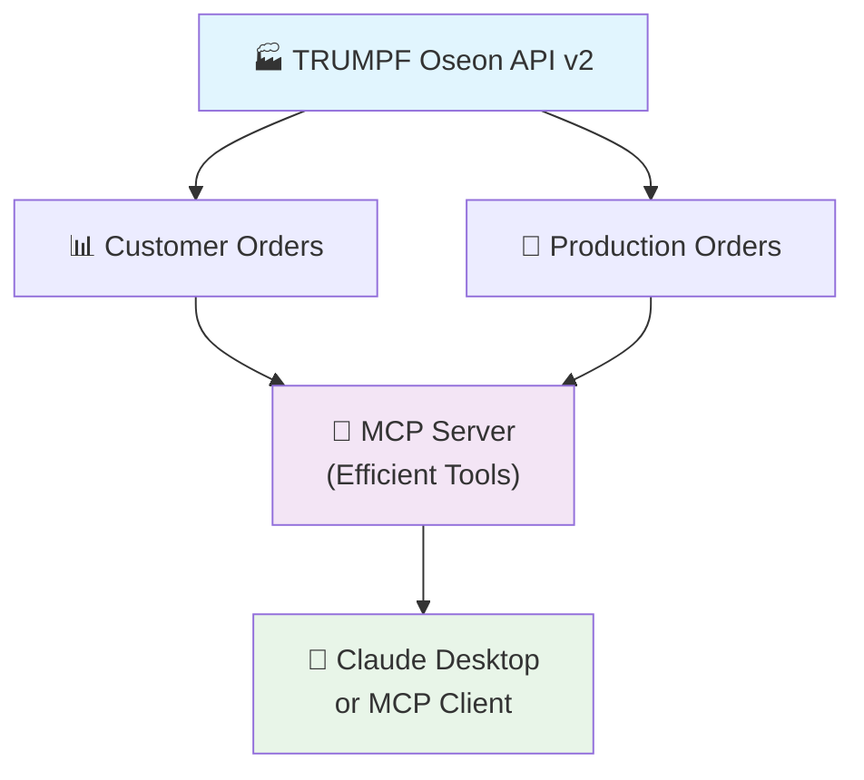

# TRUMPF Oseon MCP Server

A Model Context Protocol (MCP) server that connects AI assistants to TRUMPF Oseon's API v2 for customer order and production management.


**Educational demonstration only.** TRUMPF Oseon is a trademark of TRUMPF Co. KG. No official affiliation.

**Purpose:** Demonstrate how to connect AI assistants to manufacturing systems for intelligent order management and production insights.

## What This Does

Connect AI assistants (like Claude) directly to your TRUMPF Oseon system to:
- 🏭 **Consistent dashboards** - `get_production_dashboard()` and `get_sales_dashboard()` with identical structure every time
- 📊 **Query customer orders** - "Show me recent orders for customer XYZ"
- 🔧 **Check production status** - "What's in progress?", "What's released?", "What's finished?"
- 🔍 **Search orders efficiently** - "Find everything related to ORDER123"
- 📈 **Get data intelligently** - Auto-fetches up to 200 records with smart pagination
- 🔗 **Link related data** - "Which production orders belong to customer order ORDER123?"

## Quick Start

### Requirements
- Python 3.10+
- TRUMPF Oseon system with API v2 access
- [Claude Desktop](https://claude.ai/download) or another MCP client

### Installation

1. **Install uv** (modern Python package manager):
   ```bash
   curl -LsSf https://astral.sh/uv/install.sh | sh
   ```

2. **Clone and setup**:
   ```bash
   git clone <repository-url>
   cd trumpf-oseon-mcp
   uv sync
   ```

3. **Configure your Oseon connection**:
   ```bash
   cp env.example .env
   # Edit .env with your TRUMPF Oseon server details
   ```

4. **Test the server**:
   ```bash
   uv run mcp dev trumpf_oseon_mcp.py
   ```

5. **Add to Claude Desktop**:
   ```bash
   uv run mcp install trumpf_oseon_mcp.py --name "TRUMPF Oseon"
   ```

6. **Start using it** - Try asking Claude:
   - **"Get production dashboard"** (consistent management overview)
   - **"Get sales dashboard"** (consistent management overview)
   - **"Get production dashboard template"** (instant React artifact)
   - **"Get sales dashboard template"** (instant React artifact)
   - "Show me the latest customer orders"
   - "Find orders containing 'steel'"

## Features

- **🎯 AI Agent Reliable**: Dashboards always return identical structure for consistent agent responses
- **🎨 Instant Artifacts**: Precompiled React/TypeScript templates for Claude to create visual dashboards
- **📊 Consistent Data**: Limited results (25 per section) prevent overload, perfect for management meetings
- **⚡ Efficient Design**: All functions use proper API filtering instead of client-side scanning
- **🔗 Cross-System Linking**: Connect customer orders to production orders seamlessly
- **🔍 Smart Search**: Use `%` patterns for flexible wildcard searching
- **⚠️ Fixed Overdue Logic**: Properly identifies overdue orders with correct date handling
- **🏭 API-Native Status**: Uses real TRUMPF API status values (RELEASED=30, IN_PROGRESS=60, FINISHED=90)
- **📈 Auto-Pagination**: Smart pagination auto-fetches up to 200 records (4 pages)
- **💾 Bulk Operations**: Dedicated functions for 200+ records with array storage
- **🔐 Secure Authentication**: Configurable credentials with TRUMPF headers

## Available Tools

### 🎯 Management Dashboards (AI Agent Optimized)
- **get_production_dashboard** - Consistent data: active work, pipeline, completions, issues (max 25 each)
- **get_sales_dashboard** - Consistent data: new business, ready for production, delivery issues, changes (max 25 each)

### 🎨 Dashboard Templates (Instant Artifacts)
- **get_production_dashboard_template** - Ready React/TypeScript component for Claude artifacts
- **get_sales_dashboard_template** - Ready React/TypeScript component for Claude artifacts

### Customer Orders
- **get_customer_orders** - Main tool: auto-fetches up to 200 records with smart pagination
- **get_customer_order_details** - Detailed information about a specific order
- **browse_customer_orders_paginated** - Interactive browsing with confirmation
- **get_latest_orders_for_customer** - Recent orders for a specific customer
- **check_customer_order_overdue** - Find overdue orders for a specific customer (efficient)
- **get_orders_with_advanced_filter** - Complex multi-criteria filtering
- **search_orders_advanced** - Advanced search with multiple options
- **get_modified_orders** - Recently modified orders
- **get_recent_orders** - Orders from last N days
- **get_orders_by_item** - Find orders containing specific items
- **get_customer_orders_bulk** - Bulk retrieval for 200+ records with array storage

### Production Orders
- **get_production_orders** - Main tool: auto-fetches up to 200 records with smart pagination
- **get_released_production_orders** - Orders with RELEASED status (API native)
- **get_in_progress_production_orders** - Orders with IN_PROGRESS status (API native)
- **get_finished_production_orders** - Orders with FINISHED status (API native)
- **check_production_order_overdue** - Find overdue orders matching search term (efficient)
- **search_production_orders** - Search by OrderNo, OrderNoExt, or Description
- **get_production_orders_bulk** - Bulk retrieval for 200+ records with array storage

### Cross-System Integration
- **get_production_orders_for_customer_order** - Link customer orders to production orders
- **get_customer_order_for_production_order** - Link production orders back to customer orders
- **search_orders_with_wildcards** - Wildcard search across both systems

## Example Queries

### 💬 Ask Claude These Questions:

**Management Dashboards & Visual Templates:**
- 🏭 **`get_production_dashboard()`** → Consistent data format: active work, pipeline, completions, issues
- 📊 **`get_sales_dashboard()`** → Consistent data format: new orders, ready for production, delivery issues, changes
- 🎨 **`get_production_dashboard_template()`** → Ready React component for instant Claude artifacts
- 🎨 **`get_sales_dashboard_template()`** → Ready React component for instant Claude artifacts

*Perfect for AI agents - consistent data + instant visual dashboard creation*

**Quick Status Checks:**
- "Show me recent customer orders"
- "What production orders are in progress?"
- "Check for overdue orders for customer C123"

**Searching & Filtering:**
- "Find all orders for customer ACME Corp"
- "Show me released production orders"
- "Search for orders containing 'bracket'"

**Data Analysis:**
- "Get customer orders for analysis" (auto-fetches 200 records)
- "Get production orders from pages 10-15"
- "Find overdue orders matching '238259'"

**Cross-System Insights:**
- "Which production orders belong to customer order ORDER123?"
- "Find everything related to ORDER456"
- "Link customer order CO789 to its production orders"

## Key Features

### Smart Data Access
- **Auto-pagination**: Fetches up to 200 records (4 pages) by default
- **API-efficient**: Uses proper TRUMPF API filters instead of client-side scanning
- **Guidance**: Every function suggests next actions for more data

### Production Status Tools
- **Status-specific**: Separate tools for RELEASED, IN_PROGRESS, and FINISHED orders
- **Overdue detection**: Fixed logic with proper date format support
- **Bulk operations**: Dedicated functions for large datasets

### Cross-System Integration
- **Order linking**: Connect customer orders to production orders seamlessly
- **Wildcard search**: Search across both systems with % patterns
- **Efficient filtering**: All functions require proper constraints for performance

*→ [See complete tools reference](docs/tools-reference.md) for detailed usage patterns*

## Configuration

Create `.env` file from template:

```bash
OSEON_BASE_URL=http://your-oseon-server:8999
OSEON_USERNAME=your-username
OSEON_PASSWORD=your-password
OSEON_USER_HEADER=your-user
OSEON_TERMINAL_HEADER=your-terminal
OSEON_API_VERSION=2.0
```

## System Architecture


```mermaid
graph TB
    A["🏭 TRUMPF Oseon API v2"] --> B["📊 Customer Orders"]
    A --> C["🔧 Production Orders"]
    
    B --> D["🔗 MCP Server<br/>(Efficient Tools)"]
    C --> D
    
    D --> E["🤖 Claude Desktop<br/>or MCP Client"]
    
    style A fill:#e1f5fe
    style D fill:#f3e5f5
    style E fill:#e8f5e8
```

**Current API Coverage:**
- ✅ `/api/v2/sales/customerOrders` - Customer order management
- ✅ `/api/v2/pps/productionOrders/full/search` - Production order management  
- ✅ Cross-system linking and bulk data retrieval

## Demo Mode

For presentations and public showcases:
- 🏢 Customer names display as "**Sheet Metal Connect**"
- 🔢 Customer numbers display as "**C1**"
- ✅ All functionality remains identical

See `DEMO_MODE.md` for configuration details.

## Troubleshooting

### Common Issues

**Server not showing in Claude Desktop:**
- Check path in `claude_desktop_config.json`
- Restart Claude Desktop after configuration changes
- Verify Python dependencies with `uv sync`

**Authentication errors:**
- Verify credentials in `.env` file
- Check Oseon server accessibility
- Ensure correct API version (2.0)

**Connection timeouts:**
- Check network connectivity to Oseon server
- Verify base URL format and port

### Getting Help

1. **Check the logs** - MCP errors appear in Claude Desktop's logs
2. **Test locally** - Run `uv run mcp dev trumpf_oseon_mcp.py`
3. **Verify config** - Double-check `.env` file values
4. **Network test** - Ensure you can reach the Oseon server

## Development

Want to contribute or extend the functionality? See [docs/development.md](docs/development.md) for:
- Development environment setup
- Project structure overview
- Adding new tools and endpoints
- Testing procedures

## Advanced Usage

For power users working with large datasets, complex filtering, or bulk operations, see [docs/advanced-usage.md](docs/advanced-usage.md) for:
- Bulk data retrieval strategies
- Complex search patterns and filters
- Performance optimization tips
- Advanced pagination techniques

## 🚀 Learn More About Manufacturing AI

This project demonstrates connecting AI agents to manufacturing systems. If you're interested in:

- **🤖 Implementing MCP servers** for your production systems
- **🏭 Connecting AI agents** to your ERP, MES, or WMS
- **📊 Real-time production insights** through intelligent automation
- **🔗 System integration strategies** for Industry 4.0

**[Visit Sheet Metal Connect →](https://www.sheetmetalconnect.com/)**

## License & Credits

**License:** MIT License - see [LICENSE](LICENSE) file for details.

**Created by:** Luke van Enkhuizen ([Sheet Metal Connect e.U.](https://www.sheetmetalconnect.com/))  
**Contact:** luke@sheetmetalconnect.com  
**Development:** Built with Cursor & Claude Sonnet 4 (Vibe coded)

*Educational MCP demonstration for manufacturing system integration - Purpose: Demonstrate how to interact with your Oseon data through AI*

## Documentation

- **[Complete Tools Reference](docs/tools-reference.md)** - All tools with usage patterns
- **[Advanced Usage Guide](docs/advanced-usage.md)** - Bulk operations, complex filtering, performance tips
- **[Development Guide](docs/development.md)** - Contributing, extending, project structure
- **[MCP Protocol Documentation](https://modelcontextprotocol.io/)** - Official MCP specification
