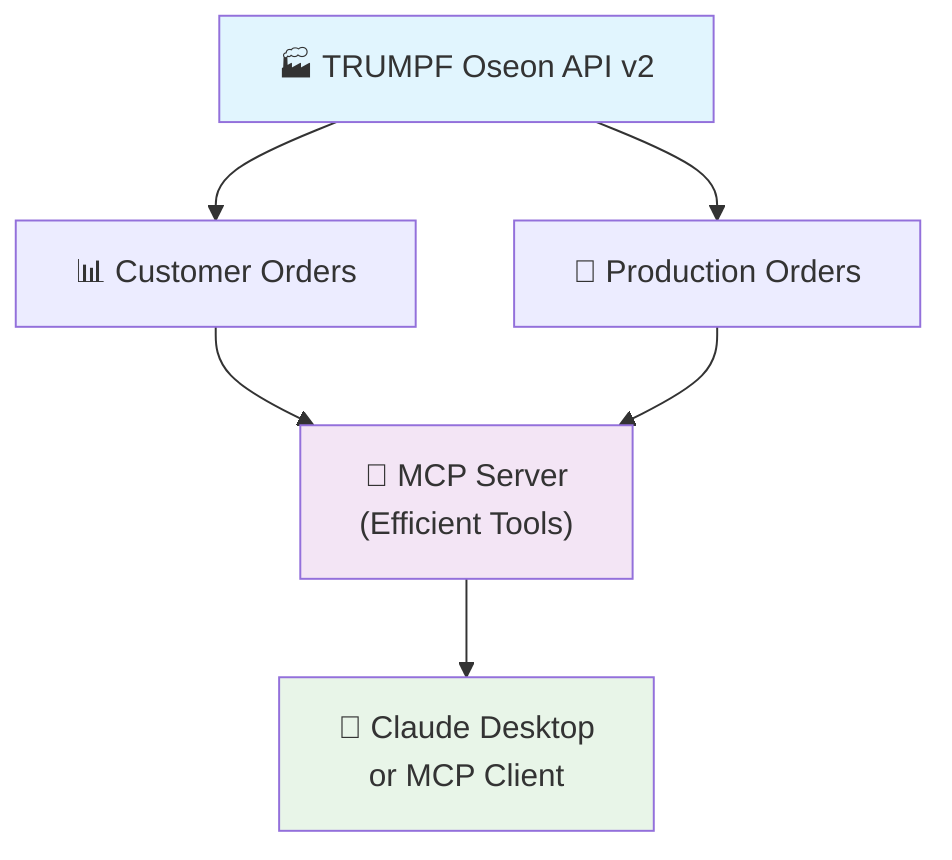

# TRUMPF Oseon MCP Server

A Model Context Protocol (MCP) server that connects AI assistants to TRUMPF Oseon's API v2 for customer order and production management.


**Educational demonstration only.** TRUMPF Oseon is a trademark of TRUMPF Co. KG. No official affiliation.

**Purpose:** Demonstrate how to connect AI assistants to manufacturing systems for intelligent order management and production insights.

## What AI Agents Can Do

Connect AI assistants (like Claude) directly to your TRUMPF Oseon system for intelligent manufacturing insights:

### 🎯 **Smart Dashboard Commands**
- 🏭 **"Show production dashboard"** → Recent activity + issues (7-day focused)
- 🏢 **"Show sales dashboard"** → Recent sales + linked production orders
- 📊 **"Get production status"** → Consistent 4-section overview every time
- 🔗 **"Sales dashboard with production"** → Auto-links sales to manufacturing

### 🔍 **Intelligent Order Analysis**
- 📋 **"Show me order 400139"** → Sales order + all matching production orders
- 🔍 **"Find RELEASED orders"** → Status filtering + production breakdown
- 🎯 **"Search for ORDER123"** → Wildcard search across both systems
- 📈 **"Recent customer activity"** → 12-month smart filtering with overrides

### 🤖 **Agent-Friendly Features**
- ⚡ **Smart defaults** - Always gets relevant data (7-day recent focus)
- 🔄 **Auto-pagination** - Fetches up to 200 records intelligently  
- 🔗 **Cross-system linking** - Sales orders automatically find production orders
- 💡 **Override guidance** - Tells agents how to get broader data when needed

## Quick Start

### Requirements
- Python 3.10+
- TRUMPF Oseon system with API v2 access
- [Claude Desktop](https://claude.ai/download) or another MCP client

### Installation

1. **Install uv** (modern Python package manager):
   ```bash
   curl -LsSf https://astral.sh/uv/install.sh | sh
   ```

2. **Clone and setup**:
   ```bash
   git clone <repository-url>
   cd trumpf-oseon-mcp
   uv sync
   ```

3. **Configure your Oseon connection**:
   ```bash
   cp env.example .env
   # Edit .env with your TRUMPF Oseon server details
   ```

4. **Test the server**:
   ```bash
   uv run mcp dev trumpf_oseon_mcp.py
   ```

5. **Add to Claude Desktop**:
   ```bash
   uv run mcp install trumpf_oseon_mcp.py --name "TRUMPF Oseon"
   ```

6. **Start using it** - Try asking Claude:
   - **"Show me the production dashboard"** → 7-day activity overview
   - **"Show sales dashboard with production"** → Sales + linked manufacturing
   - **"Find order 400139 and its production status"** → Complete cross-system view
   - **"Show me RELEASED orders"** → Status filtering + production breakdown
   - **"Get recent customer activity"** → Smart 12-month filtering
   - **"Show ALL historical data"** → Agent uses override parameters
   - **"Create production dashboard artifact"** → Instant React template

## Features

- **🔄 Unified System**: Consistent behavior across all commands with smart defaults (12-month recent data, newest first)
- **🤖 Agent-Friendly**: Intelligent override parameters for follow-up prompts and user intent adaptation
- **🎯 AI Agent Reliable**: Dashboards always return identical structure for consistent agent responses
- **🎨 Instant Artifacts**: Precompiled React/TypeScript templates for Claude to create visual dashboards
- **📊 Quality Data**: Automatic filtering of template/test orders with override options
- **⚡ Efficient Design**: All functions use proper API filtering instead of client-side scanning
- **🔗 Cross-System Linking**: Connect customer orders to production orders seamlessly
- **🔍 Smart Search**: Use `%` patterns for flexible wildcard searching
- **⚠️ Fixed Overdue Logic**: Properly identifies overdue orders with correct date handling
- **🏭 API-Native Status**: Uses real TRUMPF API status values (RELEASED=30, IN_PROGRESS=60, FINISHED=90)
- **📈 Auto-Pagination**: Smart pagination auto-fetches up to 200 records (4 pages)
- **💾 Bulk Operations**: Dedicated functions for 200+ records with array storage
- **🔐 Secure Authentication**: Configurable credentials with TRUMPF headers

## Available Tools

### 🎯 Smart Dashboards (AI Agent Optimized)
- **get_production_dashboard** - 7-day production overview (active, pipeline, issues)
- **get_sales_dashboard** - 7-day sales overview (new, ready, changes)
- **get_sales_dashboard_with_production** - Sales + auto-linked production orders
- **get_sales_orders_with_production_by_status** - Status filtering + production breakdown

### 🎨 Visual Templates (Instant Artifacts)
- **get_production_dashboard_template** - Ready React component for Claude
- **get_sales_dashboard_template** - Ready React component for Claude

### 📋 Customer Orders (Unified System)
- **get_customer_orders** - Main tool: 12-month smart filtering, quality filtered, newest first
- **get_specific_sales_order_with_production** - Complete sales + production analysis
- **get_customer_order_details** - Deep dive into specific order details
- **get_latest_orders_for_customer** - Customer-specific recent activity
- **search_orders_with_wildcards** - Universal wildcard search (ORDER123%)
- **get_orders_by_item** - Find orders containing specific parts/materials
- **get_customer_orders_bulk** - Bulk operations for large datasets

### 🏭 Production Orders (Unified System)
- **get_production_orders** - Main tool: 12-month smart filtering, quality filtered, newest first
- **get_production_orders_for_customer_order** - Sales → Production linking (uses % pattern)
- **get_in_progress_production_orders** - Current manufacturing (Status: 60)
- **get_released_production_orders** - Ready for production (Status: 30)
- **get_finished_production_orders** - Completed manufacturing (Status: 90)
- **search_production_orders** - Find by order number or description

### 🔗 Cross-System Intelligence
- **get_production_orders_for_customer_order** - Sales → Production (ORDER123 → ORDER123-001, ORDER123-002)
- **get_customer_order_for_production_order** - Production → Sales (reverse lookup)
- **search_orders_with_wildcards** - Universal search across both systems (ORDER% pattern)
- **get_sales_dashboard_with_production** - Automatic cross-system dashboard

## Agent Command Examples

### 🎯 **Smart Dashboard Commands**

**📊 Quick Status Overview:**
- **"Show me the production dashboard"** → 7-day activity + issues
- **"Show sales dashboard with production"** → Recent sales + linked manufacturing  
- **"Get production status"** → Consistent 4-section management view
- **"Create a production dashboard artifact"** → Instant React visual

### 🔍 **Intelligent Order Analysis**

**🎯 Specific Order Investigation:**
- **"Show me order 400139"** → Sales order + all production orders (400139-001, 400139-002)
- **"Find RELEASED orders and their production status"** → Status filter + manufacturing breakdown
- **"Analyze customer ACME's recent activity"** → Customer-focused analysis

**🔍 Smart Search & Filtering:**
- **"Find orders containing 'steel'"** → Cross-system material search
- **"Show me overdue production orders"** → Issue identification
- **"Search for ORDER123 family"** → Wildcard search (ORDER123%)

### 🤖 **Agent Override Examples**

**📈 Broader Data Access:**
- **"Show me ALL historical production data"** → Agent uses `include_all_data=True`
- **"Get customer orders from last 6 months"** → Agent uses `since_days=180`
- **"Include template orders in the analysis"** → Agent uses `filter_quality=False`

*Perfect for AI agents - smart defaults with intelligent override capabilities*

## Agent Intelligence Features

### 🧠 **Smart Defaults**
- **7-day focus**: Dashboards show recent activity for daily operations
- **12-month filtering**: Main tools default to relevant recent data
- **Quality filtering**: Automatically excludes template/test orders
- **Override guidance**: Tells agents how to access broader data

### 🔗 **Cross-System Intelligence**
- **Auto-linking**: Sales orders automatically find production orders (ORDER123 → ORDER123%)
- **Bidirectional**: Production orders link back to sales orders
- **Status mapping**: Converts between sales statuses (RELEASED) and production statuses (30)
- **Wildcard patterns**: Universal % search across both systems

### 📊 **Agent-Optimized Design**
- **Consistent structure**: Dashboards always return identical format
- **Performance limits**: Max 25 records per dashboard section prevents overload
- **Error handling**: Graceful failures with helpful guidance
- **Action chaining**: Functions suggest next logical steps

*→ [Complete Agent Commands](docs/tools-reference.md) | [Action Chains & Workflows](docs/advanced-usage.md)*

## Configuration

Create `.env` file from template:

```bash
OSEON_BASE_URL=http://your-oseon-server:8999
OSEON_USERNAME=your-username
OSEON_PASSWORD=your-password
OSEON_USER_HEADER=your-user
OSEON_TERMINAL_HEADER=your-terminal
OSEON_API_VERSION=2.0
```

## System Architecture


```mermaid
graph TB
    A["🏭 TRUMPF Oseon API v2"] --> B["📊 Customer Orders"]
    A --> C["🔧 Production Orders"]
    
    B --> D["🔗 MCP Server<br/>(Efficient Tools)"]
    C --> D
    
    D --> E["🤖 Claude Desktop<br/>or MCP Client"]
    
    style A fill:#e1f5fe
    style D fill:#f3e5f5
    style E fill:#e8f5e8
```

**Current API Coverage:**
- ✅ `/api/v2/sales/customerOrders` - Customer order management
- ✅ `/api/v2/pps/productionOrders/full/search` - Production order management  
- ✅ Cross-system linking and bulk data retrieval

## Demo Mode

For presentations and public showcases:
- 🏢 Customer names display as "**Sheet Metal Connect**"
- 🔢 Customer numbers display as "**C1**"
- ✅ All functionality remains identical

See `DEMO_MODE.md` for configuration details.

## Troubleshooting

### Common Issues

**Server not showing in Claude Desktop:**
- Check path in `claude_desktop_config.json`
- Restart Claude Desktop after configuration changes
- Verify Python dependencies with `uv sync`

**Authentication errors:**
- Verify credentials in `.env` file
- Check Oseon server accessibility
- Ensure correct API version (2.0)

**Connection timeouts:**
- Check network connectivity to Oseon server
- Verify base URL format and port

### Getting Help

1. **Check the logs** - MCP errors appear in Claude Desktop's logs
2. **Test locally** - Run `uv run mcp dev trumpf_oseon_mcp.py`
3. **Verify config** - Double-check `.env` file values
4. **Network test** - Ensure you can reach the Oseon server

## Development

Want to contribute or extend the functionality? See [docs/development.md](docs/development.md) for:
- Development environment setup
- Project structure overview
- Adding new tools and endpoints
- Testing procedures

## Advanced Usage

For power users working with large datasets, complex filtering, or bulk operations, see [docs/advanced-usage.md](docs/advanced-usage.md) for:
- Bulk data retrieval strategies
- Complex search patterns and filters
- Performance optimization tips
- Advanced pagination techniques

## 🚀 Learn More About Manufacturing AI

This project demonstrates connecting AI agents to manufacturing systems. If you're interested in:

- **🤖 Implementing MCP servers** for your production systems
- **🏭 Connecting AI agents** to your ERP, MES, or WMS
- **📊 Real-time production insights** through intelligent automation
- **🔗 System integration strategies** for Industry 4.0

**[Visit Sheet Metal Connect →](https://www.sheetmetalconnect.com/)**

## License & Credits

**License:** MIT License - see [LICENSE](LICENSE) file for details.

**Created by:** Luke van Enkhuizen ([Sheet Metal Connect e.U.](https://www.sheetmetalconnect.com/))  
**Contact:** luke@sheetmetalconnect.com  
**Development:** Built with Cursor & Claude Sonnet 4 (Vibe coded)

*Educational MCP demonstration for manufacturing system integration - Purpose: Demonstrate how to interact with your Oseon data through AI*

## Documentation

- **[Complete Tools Reference](docs/tools-reference.md)** - All tools with usage patterns
- **[Advanced Usage Guide](docs/advanced-usage.md)** - Bulk operations, complex filtering, performance tips
- **[Development Guide](docs/development.md)** - Contributing, extending, project structure
- **[MCP Protocol Documentation](https://modelcontextprotocol.io/)** - Official MCP specification
