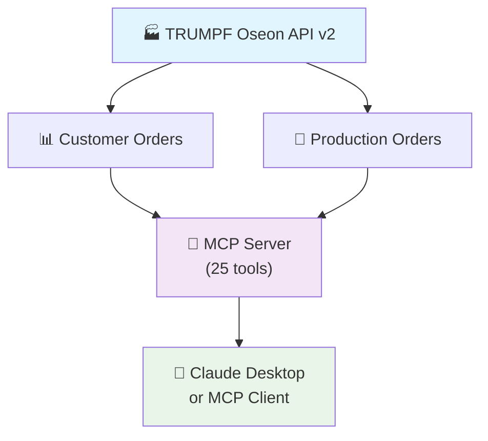

# TRUMPF Oseon MCP Server

A Model Context Protocol (MCP) server that connects AI assistants to TRUMPF Oseon's API v2 for customer order and production management.


**⚠️ Disclaimer:** Educational demonstration only. TRUMPF Oseon is a trademark of TRUMPF Co. KG. No official affiliation.

## What This Does

Connect AI assistants (like Claude) directly to your TRUMPF Oseon system to:
- 📊 **Query customer orders** - "Show me recent orders for customer XYZ"
- 🔧 **Check production status** - "How's production going?"
- 🔍 **Search across systems** - "Find everything related to ORDER123"
- 📈 **Analyze large datasets** - "Get 200 production orders for analysis"
- 🔗 **Link related data** - "Which production orders belong to customer order ORDER123?"

## Quick Start

### Requirements
- Python 3.10+
- TRUMPF Oseon system with API v2 access
- [Claude Desktop](https://claude.ai/download) or another MCP client

### Installation

1. **Install uv** (modern Python package manager):
   ```bash
   curl -LsSf https://astral.sh/uv/install.sh | sh
   ```

2. **Clone and setup**:
   ```bash
   git clone <repository-url>
   cd trumpf-oseon-mcp
   uv sync
   ```

3. **Configure your Oseon connection**:
   ```bash
   cp env.example .env
   # Edit .env with your TRUMPF Oseon server details
   ```

4. **Test the server**:
   ```bash
   uv run mcp dev trumpf_oseon_mcp.py
   ```

5. **Add to Claude Desktop**:
   ```bash
   uv run mcp install trumpf_oseon_mcp.py --name "TRUMPF Oseon"
   ```

6. **Start using it** - Try asking Claude:
   - "Show me the latest customer orders"
   - "How's production going?"
   - "Find orders containing 'steel'"

## Features

- **Comprehensive Order Management**: Customer orders + production orders
- **Smart Pagination**: Auto-latest page for recent data, not oldest first
- **Cross-System Linking**: Connect customer orders to production orders and vice versa
- **Wildcard Search**: Use `%` patterns for flexible searching across both systems
- **Advanced Filtering**: Multiple filter combinations (status, dates, customer, items)
- **Production Insights**: "How's production?" status overviews and active/overdue tracking
- **Detailed Information**: Full order details with positions, pricing, and operations
- **Secure Authentication**: Configurable credentials with TRUMPF headers
- **Demo Mode**: Sanitized data for presentations and videos
- **Bulk Data Retrieval**: Get hundreds of records efficiently across multiple pages
- **Performance Optimized**: Smart pagination and error handling for production use

## Available Tools (23 tools)

### Customer Orders (13 tools)
1. **get_customer_orders** - Get paginated customer orders with filtering (auto-latest page)
2. **get_customer_order_details** - Get detailed information about a specific order
3. **browse_customer_orders_paginated** - Browse through multiple pages with confirmation
4. **get_latest_orders_for_customer** - Get most recent orders for a specific customer
5. **get_overdue_orders** - Find customer orders past their delivery due date
6. **get_orders_with_advanced_filter** - Advanced filtering for customer orders
7. **get_newest_orders** - Get newest orders from the last N days
8. **get_released_orders** - Get released orders from specified timeframe
9. **get_completed_orders** - Get completed orders from specified timeframe
10. **search_orders_advanced** - Advanced search with multiple criteria
11. **get_modified_orders** - Get recently modified orders
12. **get_recent_orders** - Get orders from the last N days
13. **get_orders_by_item** - Find orders containing specific items

### Production Orders (5 tools)
14. **get_production_orders** - Get production orders with filtering (auto-latest page)
15. **get_production_status_overview** - Production status summary (perfect for "How's production?")
16. **get_overdue_production_orders** - Find production orders past due date
17. **get_active_production_orders** - Get currently active production orders
18. **search_production_orders** - Search by OrderNo, OrderNoExt, or Description

### Cross-System Integration (3 tools)
19. **get_production_orders_for_customer_order** - Find production orders linked to customer order
20. **get_customer_order_for_production_order** - Find customer order from production order
21. **search_orders_with_wildcards** - Wildcard search across both systems

### Bulk Data Retrieval (2 tools)
22. **get_production_orders_bulk** - Get multiple pages of production orders (e.g., pages 234-236)
23. **get_customer_orders_bulk** - Get multiple pages of customer orders

## Example Queries

### 💬 Ask Claude These Questions:

**Quick Status Checks:**
- "How's production going?"
- "What orders are overdue?"
- "Show me today's customer orders"

**Searching & Filtering:**
- "Find all orders for customer ACME Corp"
- "Show me completed orders from last week"
- "Search for orders containing 'bracket'"

**Data Analysis:**
- "Get 200 production orders for analysis"
- "Show me pages 10-15 of customer orders"
- "Export overdue production orders"

**Cross-System Insights:**
- "Which production orders belong to customer order ORDER123?"
- "Find everything related to ORDER456"
- "Link customer order CO789 to its production orders"

## Available Tools Overview

### Customer Orders (13 tools)
- Basic retrieval and pagination
- Search by order number, customer, or items
- Filter by status, dates, and advanced criteria
- Bulk data export for analysis

### Production Orders (5 tools)
- Production status overview
- Search and filter active/overdue orders
- Bulk retrieval for large datasets

### Cross-System Integration (3 tools)
- Link customer orders to production orders
- Wildcard search across both systems
- Advanced pagination controls

*→ [See complete tools reference](docs/tools-reference.md) for all 23 tools with agentic workflow patterns*

## Configuration

Create `.env` file from template:

```bash
OSEON_BASE_URL=http://your-oseon-server:8999
OSEON_USERNAME=your-username
OSEON_PASSWORD=your-password
OSEON_USER_HEADER=your-user
OSEON_TERMINAL_HEADER=your-terminal
OSEON_API_VERSION=2.0
```

## System Architecture


```mermaid
graph TB
    A["🏭 TRUMPF Oseon API v2"] --> B["📊 Customer Orders"]
    A --> C["🔧 Production Orders"]
    
    B --> D["🔗 MCP Server<br/>(25 tools)"]
    C --> D
    
    D --> E["🤖 Claude Desktop<br/>or MCP Client"]
    
    style A fill:#e1f5fe
    style D fill:#f3e5f5
    style E fill:#e8f5e8
```

**Current API Coverage:**
- ✅ `/api/v2/sales/customerOrders` - Customer order management
- ✅ `/api/v2/pps/productionOrders/full/search` - Production order management  
- ✅ Cross-system linking and bulk data retrieval

## Demo Mode

For presentations and public showcases:
- 🏢 Customer names display as "**Sheet Metal Connect**"
- 🔢 Customer numbers display as "**C1**"
- ✅ All functionality remains identical

See `DEMO_MODE.md` for configuration details.

## Troubleshooting

### Common Issues

**Server not showing in Claude Desktop:**
- Check path in `claude_desktop_config.json`
- Restart Claude Desktop after configuration changes
- Verify Python dependencies with `uv sync`

**Authentication errors:**
- Verify credentials in `.env` file
- Check Oseon server accessibility
- Ensure correct API version (2.0)

**Connection timeouts:**
- Check network connectivity to Oseon server
- Verify base URL format and port

### Getting Help

1. **Check the logs** - MCP errors appear in Claude Desktop's logs
2. **Test locally** - Run `uv run mcp dev trumpf_oseon_mcp.py`
3. **Verify config** - Double-check `.env` file values
4. **Network test** - Ensure you can reach the Oseon server

## Development

Want to contribute or extend the functionality? See [docs/development.md](docs/development.md) for:
- Development environment setup
- Project structure overview
- Adding new tools and endpoints
- Testing procedures

## Advanced Usage

For power users working with large datasets, complex filtering, or bulk operations, see [docs/advanced-usage.md](docs/advanced-usage.md) for:
- Bulk data retrieval strategies
- Complex search patterns and filters
- Performance optimization tips
- Advanced pagination techniques

## 🚀 Learn More About Manufacturing AI

This project demonstrates connecting AI agents to manufacturing systems. If you're interested in:

- **🤖 Implementing MCP servers** for your production systems
- **🏭 Connecting AI agents** to your ERP, MES, or WMS
- **📊 Real-time production insights** through intelligent automation
- **🔗 System integration strategies** for Industry 4.0

**[Visit Sheet Metal Connect →](https://www.sheetmetalconnect.com/)**

## License & Credits

**License:** MIT License - see [LICENSE](LICENSE) file for details.

**Created by:** Luke van Enkhuizen ([Sheet Metal Connect e.U.](https://www.sheetmetalconnect.com/))  
**Contact:** luke@sheetmetalconnect.com  
**Development:** Built with Cursor & Claude 4 Sonnet

*Educational MCP demonstration for manufacturing system integration*

## Documentation

- **[Complete Tools Reference](docs/tools-reference.md)** - All 23 tools with agentic workflow patterns
- **[Advanced Usage Guide](docs/advanced-usage.md)** - Bulk operations, complex filtering, performance tips
- **[Development Guide](docs/development.md)** - Contributing, extending, project structure
- **[MCP Protocol Documentation](https://modelcontextprotocol.io/)** - Official MCP specification
