# 🏭 TRUMPF Oseon MCP Server


**Ask Claude natural questions about your manufacturing system and get real-time answers from your actual production data.**


*Demo project by Luke van Enkhuizen ([vanenkhuizen.com](https://vanenkhuizen.com)) - No TRUMPF affiliation*

## What You Can Ask Claude

**Customer Orders & Production (Both Directions):**
- *"Show me order 400139 and all its production jobs"*
- *"Find production order 400139-001 and its customer order"*
- *"What customer orders are ready for production?"*

**Smart Filtering & Time Ranges:**
- *"Show me overdue orders from the last 12 months"*
- *"What's been completed this week?"*
- *"Find ACME customer orders since January"*

**Manufacturing Intelligence:**
- *"Create a production dashboard for the morning meeting"*
- *"Show me bottlenecks in the shop floor"*
- *"Which customers have the most active orders?"*

## 🚀 Quick Start

**Requirements:** Python 3.10+, [Claude Desktop](https://claude.ai/download) (MCP support may require paid tier), access to TRUMPF Oseon API v2

**Setup:**
```bash
# Install uv package manager
# Windows: irm https://astral.sh/uv/install.ps1 | iex
# macOS/Linux: curl -LsSf https://astral.sh/uv/install.sh | sh

# Get the project
git clone https://github.com/YOUR-USERNAME/trumpf-oseon-mcp.git
cd trumpf-oseon-mcp
uv sync

# Configure (copy env.example to .env, add your Oseon server details)
copy env.example .env    # Windows
cp env.example .env      # macOS/Linux

# Connect to Claude Desktop
uv run mcp install -m trumpf_oseon_mcp --name "TRUMPF Oseon"
```

**Test it works:**
Open Claude Desktop and ask: *"Show me today's production status"*

## What is MCP and Why Does it Matter?

**Model Context Protocol (MCP)** is a new standard that lets AI assistants securely connect to your business systems. Think of it as a universal translator between AI and your software.

**Before MCP:** Copy data → Paste into AI → Get generic advice  
**With MCP:** AI connects directly → Sees live data → Gives specific, actionable insights

## What is Claude?

**Claude** is an AI assistant (alternative to ChatGPT) that supports the MCP protocol, allowing it to use tools like this one. Unlike ChatGPT, Claude can directly connect to your systems through MCP servers and work with live data instead of just text.

**Claude Desktop** supports MCP, or you can host your own chat client (like LibreChat) for complete local control.

## How It Works

```mermaid
graph TB
    A["🏭 TRUMPF Oseon<br/>Manufacturing System"] --> B["📊 Customer Orders<br/>Production Orders"]
    A --> C["🔧 Real-time Data<br/>Status Updates"]
    
    B --> D["🔗 MCP Server<br/>(Runs on Your PC)"]
    C --> D
    
    D --> E["🤖 Claude Desktop<br/>or Local Chat Client"]
    E --> F["💬 Natural Language<br/>Manufacturing Insights"]
    
    style A fill:#e1f5fe
    style D fill:#f3e5f5
    style E fill:#e8f5e8
    style F fill:#fff3e0
```



**Key Points:**
- **Runs locally** - MCP server runs on your PC, connects to your local TRUMPF setup
- **Private data** - Only chat messages go through Claude, your manufacturing data stays local
- **Both directions** - Drill down from customer orders to production orders and back
- **Smart filtering** - Ask for specific timeframes ("last 12 months"), statuses, customers
- **Your credentials** - Uses your normal Oseon user logins (keep .env secure - this data is sensitive)

## Why This Matters for Manufacturing

**Current reality:** You have data trapped in your manufacturing system. You need to log in, navigate menus, run reports, export to Excel, then analyze.

**With this approach:** Ask questions in plain English and get immediate answers from live production data.

**Real industry impact:**
- Floor managers get instant status updates during daily huddles
- Customer service gives accurate delivery dates in seconds  
- Production planners spot bottlenecks before they happen
- Plant managers see the big picture without hunting through screens

## Documentation

- **[Complete Tools Reference](docs/tools-reference.md)** - All available commands
- **[Development Guide](docs/development.md)** - Contributing and extending  
- **[Advanced Usage](docs/advanced-usage.md)** - Complex workflows and bulk operations

## About

Built by [Luke van Enkhuizen](https://vanenkhuizen.com) to demonstrate how AI can directly connect to manufacturing systems. Not affiliated with TRUMPF - this is an educational exploration of what's possible when you combine AI with real production data.

**Part of a series** - This project is part of a broader exploration of AI and Agent systems for manufacturing. Check out [vanenkhuizen.com](https://vanenkhuizen.com) for more AI + manufacturing projects.

**Want to see this live on your system?** → [vanenkhuizen.com](https://vanenkhuizen.com)

**MIT License** - Use, modify, learn from this code however you want.
