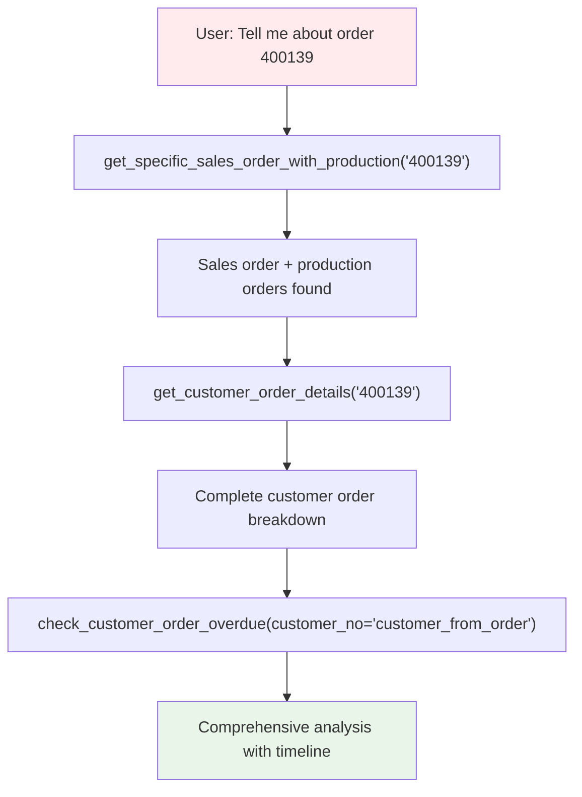
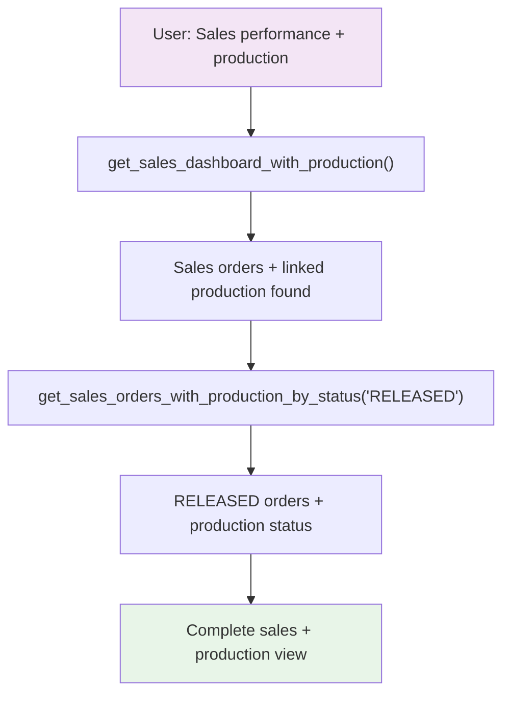

# Advanced Usage

**Complex workflows, bulk operations, and performance optimization.**

## 🔗 Smart Action Chains

### Chain 1: Complete Order Analysis
**User Request:** *"Tell me everything about order 400139"*



**Command Sequence:**
```python
# Step 1: Get overview with automatic production linking
result1 = get_specific_sales_order_with_production("400139", include_details=True)

# Step 2: Get detailed sales order information  
result2 = get_customer_order_details("400139")

# Step 3: Check for any delivery issues (optional)
result3 = check_customer_order_overdue(customer_no="extracted_from_step2")

# Agent synthesizes: Sales details + Production status + Timeline + Issues
```

### Chain 2: Cross-System Sales Analysis
**User Request:** *"Show me sales performance with production insights"*



## 🎯 User Request Translation Patterns

### Pattern 1: General Status Queries

| User Says | Agent Interprets | Command Chain |
|-----------|------------------|---------------|
| "How's production?" | Daily production overview | `get_production_dashboard()` |
| "How are sales?" | Daily sales overview | `get_sales_dashboard()` |
| "How's the business?" | Complete overview | `get_sales_dashboard_with_production()` |
| "Any issues?" | Problem detection | Dashboard → Overdue checks |

### Pattern 2: Specific Order Queries

| User Says | Agent Interprets | Command Chain |
|-----------|------------------|---------------|
| "Tell me about order 400139" | Complete order analysis | `get_specific_sales_order_with_production()` → details |
| "Find order 400139" | Search and analyze | `search_orders_with_wildcards()` → specific analysis |
| "What's the status of 400139?" | Current status check | Specific analysis → production status |
| "Where is order 400139 in production?" | Production focus | `get_production_orders_for_customer_order()` |

### Pattern 3: Status Filtering Requests

| User Says | Agent Interprets | Command Chain |
|-----------|------------------|---------------|
| "Show me RELEASED orders" | Status filtering + production | `get_sales_orders_with_production_by_status("RELEASED")` |
| "What's in production?" | Active manufacturing | `get_in_progress_production_orders()` |
| "What's ready to ship?" | Completed orders | `get_finished_production_orders()` |
| "Any overdue orders?" | Issue detection | Overdue check functions |

## 🔄 Enhanced Sales + Production Workflows

### New Enhanced Tools Usage

**Auto-pagination (recommended):**
```python
# Gets recent 12-month data automatically (up to 200 records, quality filtered)
get_customer_orders(status="RELEASED")
get_production_orders(search_term="ORDER123%")

# Enhanced sales with automatic production linking
get_sales_dashboard_with_production()  # 7-day sales + linked production
get_sales_orders_with_production_by_status("RELEASED")  # Status filter + production

# Override for all historical data
get_production_orders(include_all_data=True)
get_customer_orders(since_date="2020-01-01T00:00:00")
```

**Bulk operations (200+ records):**
```bash
# Get specific page ranges for large datasets
get_production_orders_bulk(size=50, start_page=10, num_pages=3)
get_customer_orders_bulk(size=50, start_page=1, num_pages=5)
```

**Performance notes:**
- All functions use 50 records per page (API maximum)
- Auto-pagination fetches up to 200 records by default
- Use bulk operations only for datasets larger than 200 records

## Advanced Search Patterns

### Wildcard Search Syntax

| Pattern | Matches | Example |
|---------|---------|---------|
| `ORDER123%` | Starts with ORDER123 | ORDER123-001, ORDER123-ABC |
| `%bracket%` | Contains "bracket" | steel-bracket-001, bracket-assembly |
| `%2024` | Ends with 2024 | ORDER-2024, PROD-2024 |

**Usage:**
```bash
search_orders_with_wildcards("ORDER123%")
get_production_orders(search_term="%urgent%")
```

### Efficient Search Examples

```bash
# Cross-system search
search_orders_with_wildcards("ORDER123%")

# Status-specific searches (API efficient)
get_released_production_orders(search_term="ORDER123%")
get_in_progress_production_orders(since_days=7)

# Customer-specific overdue checks
check_customer_order_overdue(customer_no="C123")
```

## Complex Filtering Combinations

### Customer Orders Filtering (Unified System)

```bash
# Auto-pagination with filtering (12-month recent data by default)
get_customer_orders(
    status="RELEASED",
    customer_no="C123",
    search_term="steel"
)

# Override for historical data
get_customer_orders(
    status="RELEASED",
    include_all_data=True,
    filter_quality=False  # Include template/test orders
)

# Item-based search
get_orders_by_item(
    item_no="PART123",
    status_category="completed"
)

# Customer-specific queries with unified system
get_latest_orders_for_customer(
    customer_no="C123",
    max_results=50
)
```

### Production Orders Filtering

```bash
# Auto-pagination with filtering
get_production_orders(
    search_term="ORDER123%",
    status=60  # IN_PROGRESS
)

# Status-specific queries (API efficient)
get_in_progress_production_orders(search_term="ORDER123%")
get_released_production_orders(since_days=30)

# Overdue checks with constraints
check_production_order_overdue(
    search_term="ORDER123%",
    days_overdue=7
)
```

## Performance Optimization

### Visual Dashboard Creation Workflow

**For instant Claude artifacts:**

1. **Get Template**: `get_production_dashboard_template()` or `get_sales_dashboard_template()`
2. **Get Real Data**: `get_production_dashboard()` or `get_sales_dashboard()`  
3. **Claude Creates**: Visual dashboard artifact with real data
4. **Result**: Professional React dashboard ready to use

**Example workflow:**
```bash
# Step 1: Get template
get_production_dashboard_template()

# Step 2: Get current data  
get_production_dashboard()

# Step 3: Ask Claude
"Create a dashboard artifact using the template with this real data"

# Result: Instant professional dashboard with live data!
```

### Best Practices

1. **Use single dashboard commands for consistency:**
   ```bash
   # Production meeting - always same format
   get_production_dashboard()
   
   # Sales meeting - always same format
   get_sales_dashboard()
   
   # Visual dashboards - instant React artifacts
   get_production_dashboard_template()
   get_sales_dashboard_template()
   
   # Perfect for AI agents - predictable structure + instant visuals
   # Limited data (25 records per section) prevents overload
   ```

2. **Use auto-pagination by default:**
   ```bash
   # Good: Gets up to 200 records automatically
   get_customer_orders(status="RELEASED")
   
   # Only use bulk for 200+ records
   get_customer_orders_bulk(num_pages=10)  # When you need more
   ```

3. **Apply proper constraints:**
   ```bash
   # Good: Use API filters
   get_released_production_orders(search_term="ORDER123%")
   
   # Good: Use customer constraints for overdue checks
   check_customer_order_overdue(customer_no="C123")
   ```

4. **Follow pagination hints:**
   - Functions suggest next actions
   - Use bulk operations for large datasets
   - Follow suggested page ranges

### Understanding Auto-Pagination

Auto-pagination fetches up to 200 records (4 pages) intelligently:

```bash
# Default behavior - gets up to 200 records
get_customer_orders()  # Fetches 4 pages automatically
get_production_orders()  # Stops early if less data available

# Single page only
get_customer_orders(auto_paginate=false)
```

## Data Export Strategies

### Large Dataset Export

For analytical work requiring large datasets:

1. **Start with auto-pagination:**
   ```bash
   # Gets up to 200 records automatically
   get_customer_orders(status="RELEASED")
   get_production_orders(search_term="ORDER%")
   ```

2. **Use bulk operations for 200+ records:**
   ```bash
   # Explicit bulk operations for large datasets
   get_production_orders_bulk(start_page=1, num_pages=10)
   get_customer_orders_bulk(start_page=5, num_pages=8)
   ```

3. **Use status-specific functions:**
   ```bash
   # API-efficient filtering
   get_released_production_orders(since_days=30)
   get_in_progress_production_orders()
   get_finished_production_orders(since_days=7)
   ```

### Combining Customer and Production Data

```bash
# 1. Start with auto-pagination
customer_orders = get_customer_orders(status="RELEASED")

# 2. Link to production orders
for order in customer_orders:
    production_orders = get_production_orders_for_customer_order(order.number)
    
# 3. Cross-system search
all_related = search_orders_with_wildcards("PROJECT123%")
```

## Management Dashboard Commands

### `get_production_dashboard()` - Consistent Production Overview

**Single command that always returns the same structured format:**

```bash
# One command - always consistent results for AI agents
get_production_dashboard()
```

**Internally executes 4 steps with limited data (25 records each):**
- Active production work (last 7 days)
- Production pipeline (last 14 days) 
- Recent completions (last 3 days)
- Production issues (1+ days overdue)

**Consistent output format every time:**
```
🏭 PRODUCTION DASHBOARD - 2024-01-15 14:30:22

✅ Active Production: 12 orders
   └── 12 orders currently in progress (last 7 days)

⏳ Production Pipeline: 8 orders  
   └── 8 orders ready to start production (last 14 days)

🏆 Recent Completions: 5 orders
   └── 5 orders completed (last 3 days)

✅ Production Issues: 0 orders
   └── No production delays

📊 SUMMARY: 12 active | 8 pipeline | 5 completed | 0 issues
```

**Key benefits:**
- **AI Agent Reliable**: Same structure every single time
- **Limited Data**: Max 25 records per section prevents overload
- **Error Handling**: Graceful fallbacks if any section fails
- **Timestamped**: Always shows when data was generated

### `get_sales_dashboard()` - Consistent Sales Overview

**Single command that always returns the same structured format:**

```bash
# One command - always consistent results for AI agents
get_sales_dashboard()
```

**Internally executes 4 steps with limited data (25 records each):**
- New business (last 7 days)
- Orders ready for production (current RELEASED status)
- Delivery issues (1+ days overdue)
- Recent order changes (last 3 days)

**Consistent output format every time:**
```
💼 SALES DASHBOARD - 2024-01-15 14:30:25

💰 New Business: 6 orders
   └── 6 customer orders received (last 7 days)

🔄 Ready for Production: 4 orders
   └── 4 orders released to manufacturing

⚠️ Delivery Issues: 1 orders
   └── 1 customer orders overdue by 1+ days

📝 Recent Changes: 3 orders
   └── 3 orders modified (last 3 days)

📊 SUMMARY: 6 new | 4 ready | 1 issues | 3 changes
```

**Key benefits:**
- **AI Agent Reliable**: Same structure every single time
- **Limited Data**: Max 25 records per section prevents overload
- **Error Handling**: Graceful fallbacks if any section fails
- **Timestamped**: Always shows when data was generated

## Common Workflows

### Production Status Workflow

```bash
# 1. Check current status
in_progress = get_in_progress_production_orders()
released = get_released_production_orders()

# 2. Check for issues
overdue = check_production_order_overdue(search_term="ORDER123%")

# 3. Link to customer context
for order in overdue:
    customer_order = get_customer_order_for_production_order(order.number)
    details = get_customer_order_details(customer_order.number)
```

### Customer Service Workflow

```bash
# 1. Get customer's recent orders
customer_orders = get_latest_orders_for_customer(customer_no="C123")

# 2. Check for overdue items
overdue = check_customer_order_overdue(customer_no="C123")

# 3. Link to production status
for order in customer_orders:
    production_orders = get_production_orders_for_customer_order(order.number)
```

## Quick Reference

### Management Dashboard Commands

**Consistent Single Commands (AI Agent Reliable):**
```bash
get_production_dashboard()    # Always same 4-section structure, max 25 records each
get_sales_dashboard()         # Always same 4-section structure, max 25 records each
```

**Instant Visual Templates (Claude Artifacts):**
```bash
get_production_dashboard_template()    # Ready React/TypeScript component
get_sales_dashboard_template()         # Ready React/TypeScript component  
```

**Benefits:**
- **Consistent Structure**: Same format every time for AI agent reliability
- **Instant Artifacts**: Precompiled React components for visual dashboards
- **Limited Results**: Max 25 records per section prevents data overload
- **Error Handling**: Graceful fallbacks if any section fails
- **Timestamped**: Shows when data was generated
- **Professional Design**: Modern dashboard UI with Tailwind CSS
- **TypeScript Ready**: Full type safety with interfaces included

### Main Tools (Auto-pagination)
- `get_customer_orders()` - Up to 200 customer order records
- `get_production_orders()` - Up to 200 production order records

### Status-Specific Tools
- `get_released_production_orders()` - RELEASED status orders
- `get_in_progress_production_orders()` - IN_PROGRESS status orders
- `get_finished_production_orders()` - FINISHED status orders

### Constraint-Based Tools
- `check_customer_order_overdue(customer_no)` - Efficient overdue checks
- `check_production_order_overdue(search_term)` - Targeted overdue checks

### Bulk Operations (200+ records)
- `get_customer_orders_bulk()` - Large customer datasets
- `get_production_orders_bulk()` - Large production datasets

## Troubleshooting

### Performance Issues
- Use auto-pagination (gets up to 200 records efficiently)
- Apply specific filters (customer_no, search_term, status)
- Use status-specific functions for better API efficiency

### Large Datasets
- Use bulk operations only for 200+ records
- Follow pagination hints for next actions
- Use proper constraints in overdue check functions

### Best Results
- Start with auto-pagination functions
- Use API-native status filtering
- Follow function guidance for next steps