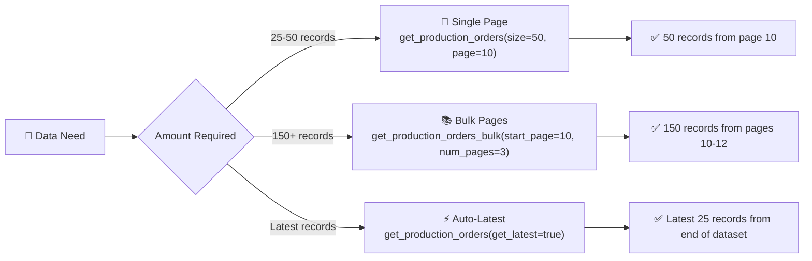

# Advanced Usage Guide

This guide covers advanced features for power users working with large datasets, complex filtering, and bulk operations.

## Bulk Data Retrieval

### Understanding Pagination Strategies


```mermaid
graph LR
    A["🎯 Data Need"] --> B{"Amount Required"}
    
    B -->|"25-50 records"| C["📄 Single Page<br/>get_production_orders(size=50, page=10)"]
    B -->|"150+ records"| D["📚 Bulk Pages<br/>get_production_orders_bulk(start_page=10, num_pages=3)"]
    B -->|"Latest records"| E["⚡ Auto-Latest<br/>get_production_orders(get_latest=true)"]
    
    C --> F["✅ 50 records from page 10"]
    D --> G["✅ 150 records from pages 10-12"]
    E --> H["✅ Latest 25 records from end of dataset"]
```

### Bulk Operations Examples

**Get multiple consecutive pages:**
```bash
# Get 3 pages of production orders (150 records total)
get_production_orders_bulk(size=50, start_page=10, num_pages=3)

# Get 5 pages of customer orders with filtering
get_customer_orders_bulk(size=50, start_page=1, num_pages=5, status="RELEASED")
```

**Performance considerations:**
- Maximum 10 pages per bulk request (500 records)
- Use appropriate page sizes (25-50 records per page)
- Apply filters to reduce dataset size when possible

## Advanced Search Patterns

### Wildcard Search Syntax

| Pattern | Matches | Example |
|---------|---------|---------|
| `ORDER123%` | Starts with ORDER123 | ORDER123-001, ORDER123-ABC |
| `%bracket%` | Contains "bracket" | steel-bracket-001, bracket-assembly |
| `%2024` | Ends with 2024 | ORDER-2024, PROD-2024 |
| `ORDER_____` | Exact length with wildcards | ORDER12345 (ORDER + 5 chars) |

### Cross-System Search Examples

```bash
# Find everything related to a customer order across both systems
search_orders_with_wildcards("ORDER123%")

# Search for specific part numbers in both customer and production orders
search_orders_with_wildcards("%PART456%")

# Find orders from specific time periods
get_recent_orders(days=30)  # Last 30 days
```

## Complex Filtering Combinations

### Customer Orders Advanced Filtering

```bash
# Multiple status filter
get_orders_with_advanced_filter(
    status=["RELEASED", "PROCESSING"],
    customer_name="ACME%",
    date_from="2024-01-01"
)

# Item-based filtering
get_orders_by_item(
    item_description="%steel%",
    status="COMPLETED"
)

# Time-based with customer filtering
get_latest_orders_for_customer(
    customer_number="C123",
    limit=50
)
```

### Production Orders Advanced Filtering

```bash
# Status and search term combination
get_production_orders(
    search_term="ORDER123%",
    status=60,  # Active production
    size=50
)

# Overdue orders with specific criteria
get_overdue_production_orders(
    search_term="%urgent%"
)
```

## Performance Optimization

### Best Practices

1. **Use appropriate page sizes:**
   - Small queries: 25 records per page
   - Bulk operations: 50 records per page
   - Never exceed 50 records per page

2. **Apply filters early:**
   ```bash
   # Good: Filter at API level
   get_customer_orders(status="RELEASED", customer_name="ACME%")
   
   # Avoid: Getting all data then filtering in Claude
   get_customer_orders() # Then asking Claude to filter
   ```

3. **Use bulk operations for large datasets:**
   ```bash
   # Efficient: Single bulk request
   get_production_orders_bulk(start_page=1, num_pages=5)
   
   # Inefficient: Multiple single-page requests
   # get_production_orders(page=1), get_production_orders(page=2), etc.
   ```

### Understanding Auto-Latest Feature

The auto-latest feature automatically calculates the last page and starts from there:

```bash
# These queries start from the newest data
get_customer_orders(get_latest=true)
get_production_orders(get_latest=true)

# Equivalent to manually calculating:
# total_pages = get_total_pages()
# get_customer_orders(page=total_pages)
```

## Data Export Strategies

### Large Dataset Export

For analytical work requiring large datasets:

1. **Plan your approach:**
   ```bash
   # Step 1: Get overview
   get_production_status_overview()
   
   # Step 2: Determine page range
   get_production_orders(size=1)  # Check total pages
   
   # Step 3: Bulk retrieve
   get_production_orders_bulk(start_page=1, num_pages=10)  # 500 records
   ```

2. **Handle large results systematically:**
   - Process data in chunks
   - Use consistent filtering across requests
   - Save intermediate results for complex analysis

### Combining Customer and Production Data

```bash
# 1. Get customer orders
customer_orders = get_customer_orders_bulk(num_pages=3)

# 2. For each customer order, get production orders
for order in customer_orders:
    production_orders = get_production_orders_for_customer_order(order.number)
    
# 3. Or search both systems simultaneously
all_related = search_orders_with_wildcards("PROJECT123%")
```

## Advanced Tool Combinations

### Production Analysis Workflow

```bash
# 1. Overview
production_status = get_production_status_overview()

# 2. Identify issues
overdue_orders = get_overdue_production_orders()
active_orders = get_active_production_orders()

# 3. Deep dive on specific orders
for order in overdue_orders:
    customer_order = get_customer_order_for_production_order(order.number)
    details = get_customer_order_details(customer_order.number)
```

### Customer Service Workflow

```bash
# 1. Find customer orders
customer_orders = get_orders_by_customer("CUSTOMER123")

# 2. Check production status for each
for order in customer_orders:
    production_orders = get_production_orders_for_customer_order(order.number)
    
# 3. Identify any issues
overdue = get_overdue_orders(customer_number="CUSTOMER123")
```

## Command Reference

### Bulk Operations
- `get_customer_orders_bulk(size, start_page, num_pages, ...filters)`
- `get_production_orders_bulk(size, start_page, num_pages, ...filters)`

### Cross-System Tools
- `search_orders_with_wildcards(search_pattern)`
- `get_production_orders_for_customer_order(customer_order_no)`
- `get_customer_order_for_production_order(production_order_no)`

### Advanced Filtering
- `get_orders_with_advanced_filter(...multiple_criteria)`
- `get_recent_orders(days)`
- `get_overdue_orders()`
- `get_overdue_production_orders()`

## Troubleshooting Advanced Operations

### Performance Issues
- Reduce page size if timeouts occur
- Apply more specific filters to reduce dataset size
- Use status filters to limit scope

### Memory Considerations
- Large bulk operations may consume significant memory
- Process results in chunks for very large datasets
- Consider breaking complex operations into smaller steps

### Rate Limiting
- The server implements reasonable rate limiting
- Bulk operations are optimized to minimize API calls
- Allow brief pauses between very large requests if needed