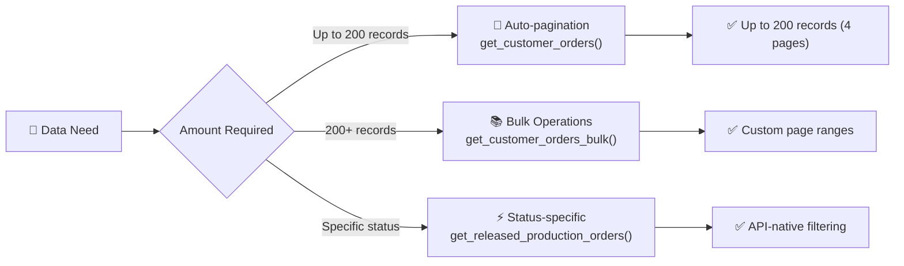

# Advanced Usage Guide

Practical guide for working with large datasets, bulk operations, and performance optimization.

## Bulk Data Retrieval

### Understanding Pagination Strategies


```mermaid
graph LR
    A["🎯 Data Need"] --> B{"Amount Required"}
    
    B -->|"Up to 200 records"| C["📄 Auto-pagination<br/>get_customer_orders()"]
    B -->|"200+ records"| D["📚 Bulk Operations<br/>get_customer_orders_bulk()"]
    B -->|"Specific status"| E["⚡ Status-specific<br/>get_released_production_orders()"]
    
    C --> F["✅ Up to 200 records (4 pages)"]
    D --> G["✅ Custom page ranges"]
    E --> H["✅ API-native filtering"]
```

### Bulk Operations Examples

**Auto-pagination (recommended):**
```bash
# Gets up to 200 records automatically (4 pages)
get_customer_orders(status="RELEASED")
get_production_orders(search_term="ORDER123%")
```

**Bulk operations (200+ records):**
```bash
# Get specific page ranges for large datasets
get_production_orders_bulk(size=50, start_page=10, num_pages=3)
get_customer_orders_bulk(size=50, start_page=1, num_pages=5)
```

**Performance notes:**
- All functions use 50 records per page (API maximum)
- Auto-pagination fetches up to 200 records by default
- Use bulk operations only for datasets larger than 200 records

## Advanced Search Patterns

### Wildcard Search Syntax

| Pattern | Matches | Example |
|---------|---------|---------|
| `ORDER123%` | Starts with ORDER123 | ORDER123-001, ORDER123-ABC |
| `%bracket%` | Contains "bracket" | steel-bracket-001, bracket-assembly |
| `%2024` | Ends with 2024 | ORDER-2024, PROD-2024 |

**Usage:**
```bash
search_orders_with_wildcards("ORDER123%")
get_production_orders(search_term="%urgent%")
```

### Efficient Search Examples

```bash
# Cross-system search
search_orders_with_wildcards("ORDER123%")

# Status-specific searches (API efficient)
get_released_production_orders(search_term="ORDER123%")
get_in_progress_production_orders(since_days=7)

# Customer-specific overdue checks
check_customer_order_overdue(customer_no="C123")
```

## Complex Filtering Combinations

### Customer Orders Filtering

```bash
# Auto-pagination with filtering
get_customer_orders(
    status="RELEASED",
    customer_no="C123",
    search_term="steel"
)

# Item-based search
get_orders_by_item(
    item_no="PART123",
    status_category="completed"
)

# Customer-specific queries
get_latest_orders_for_customer(
    customer_no="C123",
    max_results=50
)
```

### Production Orders Filtering

```bash
# Auto-pagination with filtering
get_production_orders(
    search_term="ORDER123%",
    status=60  # IN_PROGRESS
)

# Status-specific queries (API efficient)
get_in_progress_production_orders(search_term="ORDER123%")
get_released_production_orders(since_days=30)

# Overdue checks with constraints
check_production_order_overdue(
    search_term="ORDER123%",
    days_overdue=7
)
```

## Performance Optimization

### Best Practices

1. **Use auto-pagination by default:**
   ```bash
   # Good: Gets up to 200 records automatically
   get_customer_orders(status="RELEASED")
   
   # Only use bulk for 200+ records
   get_customer_orders_bulk(num_pages=10)  # When you need more
   ```

2. **Apply proper constraints:**
   ```bash
   # Good: Use API filters
   get_released_production_orders(search_term="ORDER123%")
   
   # Good: Use customer constraints for overdue checks
   check_customer_order_overdue(customer_no="C123")
   ```

3. **Follow pagination hints:**
   - Functions suggest next actions
   - Use bulk operations for large datasets
   - Follow suggested page ranges

### Understanding Auto-Pagination

Auto-pagination fetches up to 200 records (4 pages) intelligently:

```bash
# Default behavior - gets up to 200 records
get_customer_orders()  # Fetches 4 pages automatically
get_production_orders()  # Stops early if less data available

# Single page only
get_customer_orders(auto_paginate=false)
```

## Data Export Strategies

### Large Dataset Export

For analytical work requiring large datasets:

1. **Start with auto-pagination:**
   ```bash
   # Gets up to 200 records automatically
   get_customer_orders(status="RELEASED")
   get_production_orders(search_term="ORDER%")
   ```

2. **Use bulk operations for 200+ records:**
   ```bash
   # Explicit bulk operations for large datasets
   get_production_orders_bulk(start_page=1, num_pages=10)
   get_customer_orders_bulk(start_page=5, num_pages=8)
   ```

3. **Use status-specific functions:**
   ```bash
   # API-efficient filtering
   get_released_production_orders(since_days=30)
   get_in_progress_production_orders()
   get_finished_production_orders(since_days=7)
   ```

### Combining Customer and Production Data

```bash
# 1. Start with auto-pagination
customer_orders = get_customer_orders(status="RELEASED")

# 2. Link to production orders
for order in customer_orders:
    production_orders = get_production_orders_for_customer_order(order.number)
    
# 3. Cross-system search
all_related = search_orders_with_wildcards("PROJECT123%")
```

## Common Workflows

### Production Status Workflow

```bash
# 1. Check current status
in_progress = get_in_progress_production_orders()
released = get_released_production_orders()

# 2. Check for issues
overdue = check_production_order_overdue(search_term="ORDER123%")

# 3. Link to customer context
for order in overdue:
    customer_order = get_customer_order_for_production_order(order.number)
    details = get_customer_order_details(customer_order.number)
```

### Customer Service Workflow

```bash
# 1. Get customer's recent orders
customer_orders = get_latest_orders_for_customer(customer_no="C123")

# 2. Check for overdue items
overdue = check_customer_order_overdue(customer_no="C123")

# 3. Link to production status
for order in customer_orders:
    production_orders = get_production_orders_for_customer_order(order.number)
```

## Quick Reference

### Main Tools (Auto-pagination)
- `get_customer_orders()` - Up to 200 customer order records
- `get_production_orders()` - Up to 200 production order records

### Status-Specific Tools
- `get_released_production_orders()` - RELEASED status orders
- `get_in_progress_production_orders()` - IN_PROGRESS status orders
- `get_finished_production_orders()` - FINISHED status orders

### Constraint-Based Tools
- `check_customer_order_overdue(customer_no)` - Efficient overdue checks
- `check_production_order_overdue(search_term)` - Targeted overdue checks

### Bulk Operations (200+ records)
- `get_customer_orders_bulk()` - Large customer datasets
- `get_production_orders_bulk()` - Large production datasets

## Troubleshooting

### Performance Issues
- Use auto-pagination (gets up to 200 records efficiently)
- Apply specific filters (customer_no, search_term, status)
- Use status-specific functions for better API efficiency

### Large Datasets
- Use bulk operations only for 200+ records
- Follow pagination hints for next actions
- Use proper constraints in overdue check functions

### Best Results
- Start with auto-pagination functions
- Use API-native status filtering
- Follow function guidance for next steps