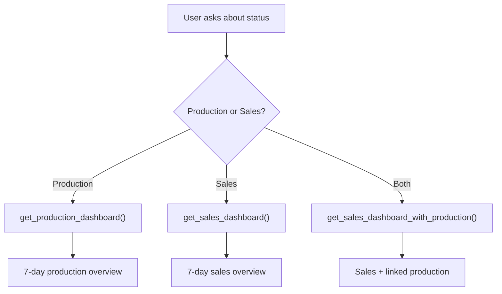
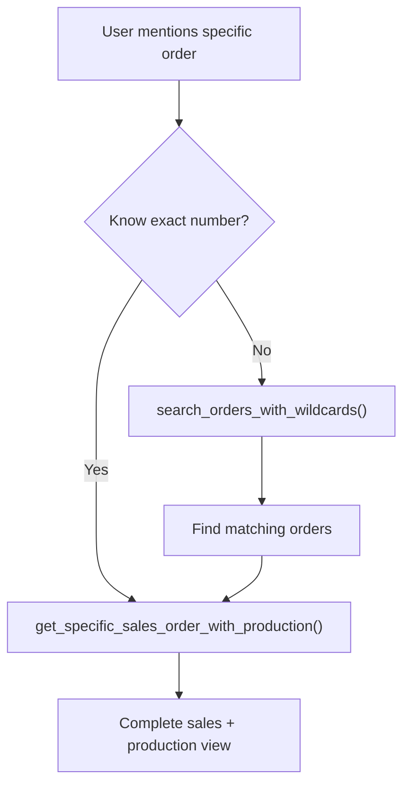
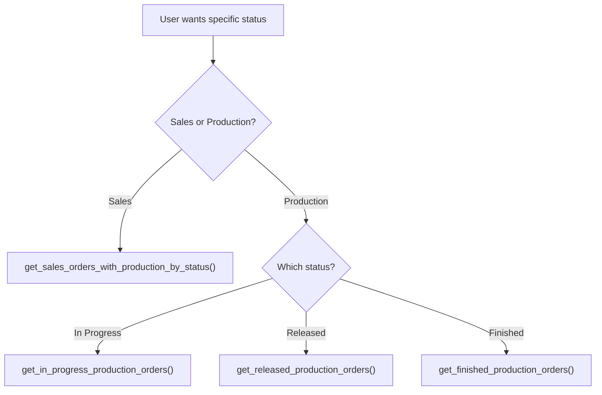

# Tools Reference

**All available commands and how to use them.**

## 🎯 **Agent Command Categories**

| Category | Purpose | Best For |
|----------|---------|----------|
| **🏢 Smart Dashboards** | Consistent overviews | Daily status, management meetings |
| **🔗 Enhanced Sales Tools** | Sales + Production linking | Cross-system analysis |
| **📋 Customer Orders** | Sales order management | Customer service, order tracking |
| **🏭 Production Orders** | Manufacturing management | Production planning, status checks |
| **🔍 Universal Search** | Cross-system queries | Finding related data |
| **📊 Bulk Operations** | Large datasets | Analysis, reporting |

---

## 🏢 Smart Dashboards (Agent-Optimized)

*These commands provide consistent, structured data perfect for AI agents.*

### `get_production_dashboard`
**Purpose:** 7-day production overview with consistent 4-section structure
**Agent Usage:** "Show me production status" / "How's production?"

```python
get_production_dashboard()
```

**Returns:**
- ✅ Active Production (last 7 days)
- ⏳ Production Pipeline (last 14 days)  
- 🏆 Recent Completions (last 3 days)
- ❌ Production Issues (1+ days overdue)

**Agent Benefits:**
- **Identical structure every time** - Perfect for consistent responses
- **Limited data** - Max 25 records per section prevents overload
- **Override guidance** - Shows how to get broader data

### `get_sales_dashboard`
**Purpose:** 7-day sales overview with consistent structure
**Agent Usage:** "Show me sales status" / "How are sales?"

```python
get_sales_dashboard()
```

**Returns:**
- 💰 New Business (last 7 days)
- 🔄 Ready for Production (RELEASED status)
- ⚠️ Delivery Issues (1+ days overdue)
- 📝 Recent Changes (last 3 days)

### `get_sales_dashboard_with_production` ⭐
**Purpose:** Enhanced sales dashboard with automatic production order linking
**Agent Usage:** "Show sales dashboard with production" / "Sales and manufacturing status"

```python
get_sales_dashboard_with_production()
```

**What it does automatically:**
1. Gets recent sales orders (last 7 days)
2. For each sales order, finds matching production orders using `%` pattern
3. Counts production status breakdown (IN_PROGRESS, RELEASED, FINISHED)
4. Shows comprehensive sales+production view

**Example Output:**
```
📋 Sales Order: 400139
   🏭 Production: 2 orders → 400139-001, 400139-002

🏭 PRODUCTION SUMMARY:
📊 Total: 15 orders | 🔄 In Progress: 5 | ⏳ Released: 8 | ✅ Finished: 2
```

### Dashboard Templates (Visual Artifacts)

#### `get_production_dashboard_template`
**Purpose:** Ready React/TypeScript component for Claude artifacts
**Agent Usage:** "Create a production dashboard" / "Make a visual dashboard"

#### `get_sales_dashboard_template`
**Purpose:** Ready React/TypeScript component for Claude artifacts
**Agent Usage:** "Create a sales dashboard" / "Make a sales visual"

---

## 🔗 Enhanced Sales Tools (Cross-System Intelligence)

*These tools automatically link sales orders to production orders for comprehensive analysis.*

### `get_sales_orders_with_production_by_status` ⭐
**Purpose:** Filter sales orders by status and show linked production orders
**Agent Usage:** "Show me RELEASED orders and their production status"

```python
get_sales_orders_with_production_by_status(
    status="RELEASED",  # Sales order status
    since_days=30,      # Look back period
    max_results=15      # Limit for performance
)
```

**Status Options:** `"RELEASED"`, `"DELIVERED"`, `"COMPLETED"`, `"PENDING"`

**What it does:**
1. Finds sales orders with specified status
2. For each sales order, searches for production orders using `ORDER%` pattern
3. Shows production status breakdown
4. Perfect for "Show me all RELEASED orders and what's happening in production"

### `get_specific_sales_order_with_production` ⭐
**Purpose:** Deep dive into specific sales order with complete production details
**Agent Usage:** "Tell me about order 400139" / "Analyze order 400139"

```python
get_specific_sales_order_with_production(
    order_pattern="400139",    # Order number or pattern
    include_details=True       # Show production operations
)
```

**Pattern Examples:**
- `"400139"` → Finds sales order 400139 + all production orders (400139-001, 400139-002)
- `"400%"` → Finds all sales orders starting with 400 + their production orders
- `"ORDER123"` → Specific order analysis

**What it shows:**
- Complete sales order details
- All linked production orders
- Production operations (if include_details=True)
- Status of each production order

---

## 📋 Customer Orders Tools

### Core Retrieval Tools

#### `get_customer_orders` (Unified System) ⭐
**Purpose:** Main customer orders tool with 12-month smart filtering
**Agent Usage:** "Show me recent customer orders" / "Get customer order data"

```python
# Smart defaults - perfect for most agent queries
get_customer_orders()  # 12-month recent, quality filtered, newest first

# With filtering (maintains smart defaults)
get_customer_orders(
    status="RELEASED",           # Filter by status
    customer_no="C123",         # Specific customer
    search_term="steel"         # Search term
)

# Agent overrides (for follow-up prompts)
get_customer_orders(include_all_data=True)              # "Show ALL data"
get_customer_orders(since_date="2023-01-01T00:00:00")   # "Since January 2023"
get_customer_orders(filter_quality=False)              # "Include test orders"
get_customer_orders(since_days=30)                     # "Last 30 days"
```

**Agent Intelligence:**
- **Smart Default:** 12-month recent data (not all historical)
- **Quality Filtering:** Excludes template/test orders automatically
- **Override Guidance:** Response tells agent how to get broader data
- **Consistent Sorting:** Always newest first

**When to use overrides:**
- User says "ALL data" → `include_all_data=True`
- User specifies timeframe → `since_date="YYYY-MM-DD"`
- User wants "everything" → `filter_quality=False`

#### `get_customer_order_details`
**Purpose:** Complete order breakdown with positions, pricing, operations
**Agent Usage:** "Get details for order ORDER123" / "Tell me more about this order"

```python
get_customer_order_details(customer_order_no="ORDER123")
```

**Agent Workflow:**
1. **Find orders** with search tools
2. **Get details** for specific orders
3. **Validate information** before making recommendations

**Shows:**
- Complete order information
- All positions and items
- Pricing breakdown
- Customer details
- Order status and dates

### Customer-Specific Tools

#### `get_latest_orders_for_customer`
**Purpose:** Customer-specific recent activity
**Agent Usage:** "Show me recent orders for customer ACME"

```python
get_latest_orders_for_customer(
    customer_no="C123",
    limit=10
)
```

#### `get_orders_by_item`
**Purpose:** Find orders containing specific items or materials
**Agent Usage:** "Find orders with steel brackets" / "What orders use part 12345?"

```python
get_orders_by_item(
    item_no="PART123",
    max_results=50,
    status_category="completed"
)
```

---

## 🏭 Production Orders Tools

### `get_production_orders` (Unified System) ⭐
**Purpose:** Main production orders tool with 12-month smart filtering
**Agent Usage:** "Show me production orders" / "Get production data"

```python
# Smart defaults
get_production_orders()  # 12-month recent, quality filtered, newest first

# With filtering
get_production_orders(
    status=60,                    # IN_PROGRESS status
    search_term="ORDER123%"       # Wildcard search
)

# Agent overrides
get_production_orders(include_all_data=True)          # "Show ALL data"
get_production_orders(filter_quality=False)          # "Include templates"
get_production_orders(since_days=7)                  # "Last week only"
```

**Status Values:**
- `30` = RELEASED (ready for production)
- `60` = IN_PROGRESS (currently manufacturing)
- `90` = FINISHED (completed)

### Status-Specific Tools (API Optimized)

#### `get_in_progress_production_orders`
**Purpose:** Orders currently being manufactured (Status: 60)
**Agent Usage:** "What's in progress?" / "Show active production"

```python
get_in_progress_production_orders(
    max_results=50,
    since_days=7,              # Optional time filter
    search_term="ORDER123%"    # Optional search
)
```

#### `get_released_production_orders`
**Purpose:** Orders ready to start production (Status: 30)
**Agent Usage:** "What's ready for production?" / "Show released orders"

#### `get_finished_production_orders`
**Purpose:** Recently completed orders (Status: 90)
**Agent Usage:** "What was completed recently?" / "Show finished orders"

---

## 🔍 Universal Search & Cross-System Tools

### `search_orders_with_wildcards` ⭐
**Purpose:** Universal search across both sales and production systems
**Agent Usage:** "Find everything related to ORDER123" / "Search for steel orders"

```python
search_orders_with_wildcards(
    search_pattern="ORDER123%",     # Wildcard pattern
    search_in="both",              # "customer", "production", or "both"
    size=25                        # Results per system
)
```

**Pattern Examples:**
- `"ORDER123%"` → All orders starting with ORDER123
- `"%steel%"` → All orders containing "steel"
- `"400%"` → All 400-series orders

**Perfect for:**
- Finding order families (ORDER123-001, ORDER123-002, etc.)
- Material searches ("%bracket%", "%steel%")
- Customer prefix searches ("%ACME%")

### Cross-System Linking Tools

#### `get_production_orders_for_customer_order` ⭐
**Purpose:** Find all production orders for a specific sales order
**Agent Usage:** "Show production orders for sales order 400139"

```python
get_production_orders_for_customer_order(
    customer_order_no="400139",
    size=50
)
```

**How it works:**
1. Takes sales order number (e.g., "400139")
2. Searches production orders using pattern "400139%"
3. Finds all related production orders (400139-001, 400139-002, etc.)
4. Shows detailed production information

#### `get_customer_order_for_production_order`
**Purpose:** Reverse lookup - find sales order from production order
**Agent Usage:** "What sales order does 400139-001 belong to?"

```python
get_customer_order_for_production_order(
    production_order_no="400139-001"
)
```

---

## 🚨 Issue Detection Tools

### `check_customer_order_overdue`
**Purpose:** Find overdue customer orders efficiently
**Agent Usage:** "Check for overdue orders" / "Any delivery issues?"

```python
check_customer_order_overdue(
    customer_no="C123",     # Optional: specific customer
    days_overdue=7          # How many days overdue
)
```

### `check_production_order_overdue`
**Purpose:** Find overdue production orders with search constraints
**Agent Usage:** "Check for production delays" / "Any overdue manufacturing?"

```python
check_production_order_overdue(
    search_term="ORDER123%",  # Required: search constraint
    days_overdue=7            # How many days overdue
)
```

---

## 📊 Bulk Operations & Advanced Tools

### Bulk Data Tools

#### `get_customer_orders_bulk`
**Purpose:** Large dataset operations (200+ records)
**Agent Usage:** When user needs extensive data analysis

```python
get_customer_orders_bulk(
    size=50,           # Records per page
    start_page=1,      # Starting page
    num_pages=5,       # Number of pages to fetch
    status="RELEASED"  # Optional filtering
)
```

#### `get_production_orders_bulk`
**Purpose:** Large production dataset operations
**Agent Usage:** For comprehensive production analysis

---

## 🎯 Agent Command Selection Guide

### For Status Overviews


### For Specific Orders


### For Status Filtering


---

## 💡 Agent Best Practices

### 1. **Start with Smart Defaults**
```python
# ✅ Good: Let the unified system handle filtering
get_customer_orders()  # Gets relevant recent data

# ❌ Avoid: Over-specifying initially
get_customer_orders(since_date="2020-01-01", filter_quality=False)  # Too broad
```

### 2. **Use Cross-System Intelligence**
```python
# ✅ Good: Leverage automatic linking
get_sales_dashboard_with_production()  # Shows both sides automatically

# ❌ Avoid: Manual linking
get_sales_dashboard() + get_production_dashboard()  # Disconnected data
```

### 3. **Follow Agent Override Guidance**
```python
# When response says "FOR MORE DATA: Use get_customer_orders(since_days=30)"
# Agent should use the suggested override for follow-up queries
```

### 4. **Chain Commands Logically**
```python
# ✅ Good workflow:
# 1. search_orders_with_wildcards("ORDER123%")  # Find related orders
# 2. get_specific_sales_order_with_production("ORDER123")  # Deep dive
# 3. get_customer_order_details("ORDER123")  # Full details if needed
```

---

## ⚡ Performance Guidelines

### Command Response Times
| Command Type | Expected Speed | Records Returned |
|--------------|----------------|------------------|
| **Dashboards** | < 3 seconds | 25 per section |
| **Main Tools** | < 2 seconds | Up to 200 (auto-paginated) |
| **Bulk Operations** | 5-10 seconds | 200+ records |
| **Cross-System** | 3-5 seconds | Depends on matches |

### When to Use Bulk vs Standard
- **Standard tools** (get_customer_orders, get_production_orders): Up to 200 records
- **Bulk tools** (get_customer_orders_bulk): 200+ records for analysis
- **Dashboard tools**: Fixed 25 records per section for consistency

---

## 🔄 Common Agent Workflows

### 1. **Daily Status Check**
```python
# User: "How's everything looking today?"
get_production_dashboard()           # Production overview
get_sales_dashboard_with_production() # Sales + manufacturing view
```

### 2. **Order Investigation**
```python
# User: "Tell me about order 400139"
get_specific_sales_order_with_production("400139")  # Complete analysis
get_customer_order_details("400139")                # Full sales details
```

### 3. **Status Analysis**
```python
# User: "Show me all RELEASED orders and their production status"
get_sales_orders_with_production_by_status("RELEASED", since_days=30)
```

### 4. **Issue Detection**
```python
# User: "Any problems I should know about?"
check_customer_order_overdue(days_overdue=3)        # Delivery issues
check_production_order_overdue("ORDER%", days_overdue=1)  # Production delays
```

This reference ensures agents can translate any user request into the optimal tool combination for accurate, comprehensive results.