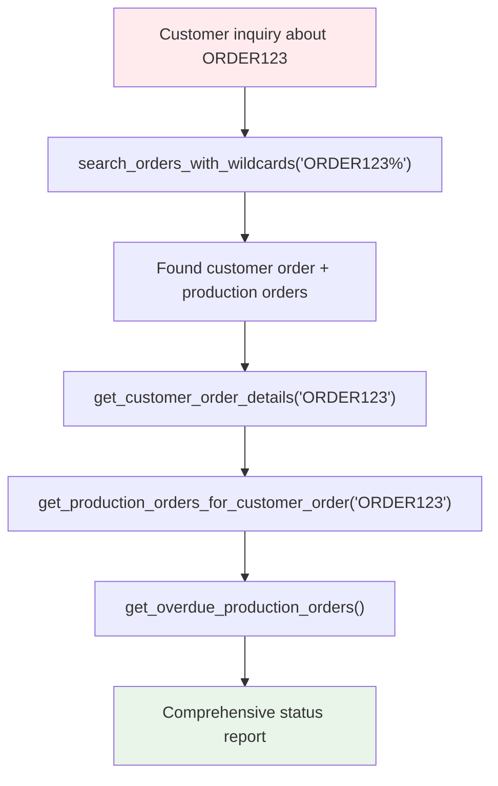
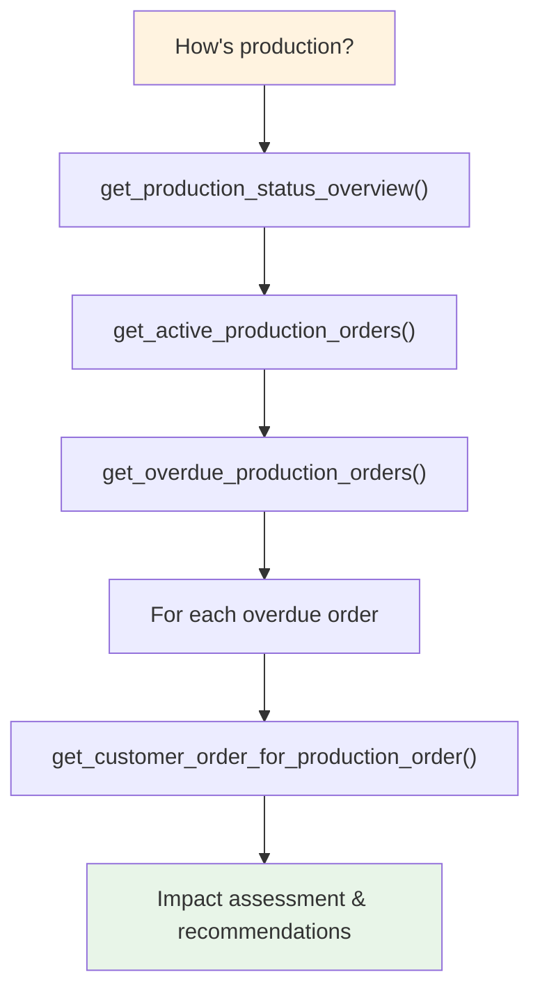
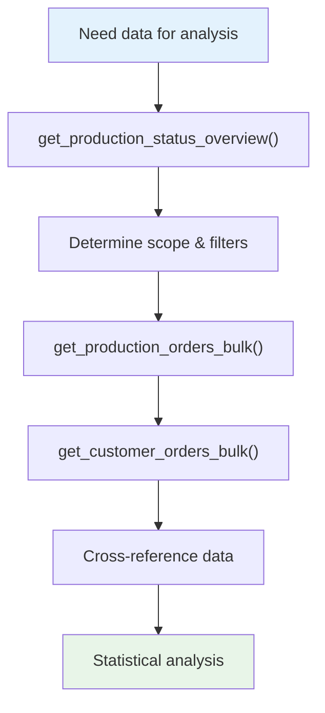
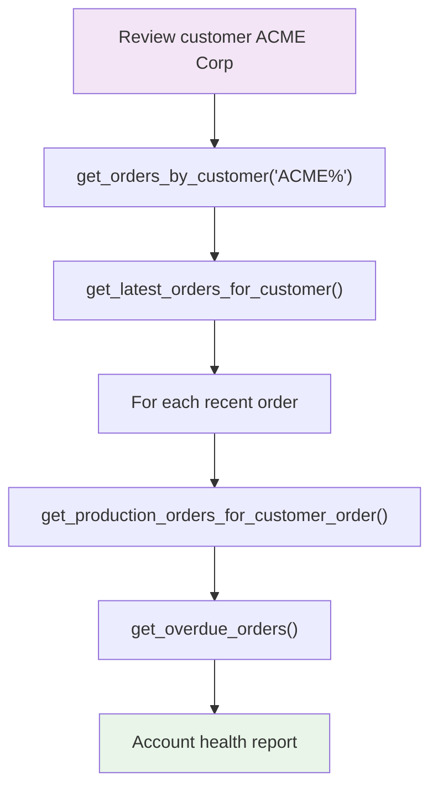
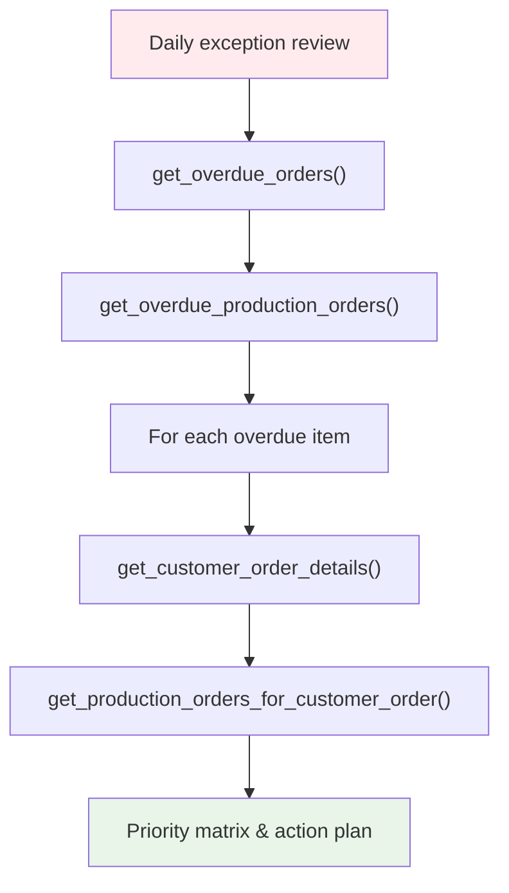
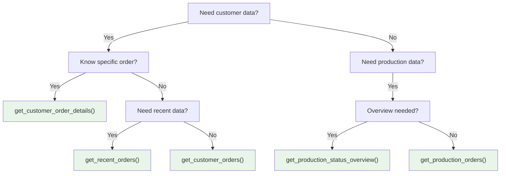

# Tools Reference & Usage Patterns

Practical guide to all MCP tools and their optimal usage patterns for interacting with TRUMPF Oseon data.

## 📊 Customer Orders Tools

### Core Retrieval Tools

#### `get_customer_orders`
**Purpose:** Main tool for customer orders - auto-fetches up to 200 records (4 pages)
**Best for:** Most queries - smart pagination handles large datasets efficiently

```python
# Default: Gets up to 200 records automatically
get_customer_orders()

# With filtering
get_customer_orders(
    status="RELEASED", 
    customer_no="C123",
    search_term="steel"
)

# Single page only
get_customer_orders(auto_paginate=false)
```

**Usage Notes:**
- **Start here:** Best for most customer order queries
- **Auto-pagination:** Fetches 4 pages (200 records) by default
- **Smart guidance:** Suggests next actions for more data

#### `get_customer_order_details`
**Purpose:** Retrieve complete order information including positions, pricing, operations
**Best for:** Deep dives into specific orders, customer service inquiries

```python
get_customer_order_details(customer_order_no="ORDER123")
```

**Agentic Usage:**
- **Follow-up tool:** After finding orders with search tools
- **Validation step:** Confirm order details before making business decisions
- **Data enrichment:** Get complete context for analysis workflows

#### `get_customer_orders_bulk`
**Purpose:** For 200+ records with structured array storage
**Best for:** Large dataset analysis, agent data collection

```python
# Get 250 orders (5 pages of 50 each)
get_customer_orders_bulk(
    size=50, 
    start_page=1, 
    num_pages=5,
    status="COMPLETED"
)
```

**Usage Notes:**
- **Large datasets:** Use for 200+ records when agent needs array storage
- **Explicit operation:** Requires specific page ranges
- **Performance:** Optimized for bulk data operations

### Navigation & Browsing Tools

#### `browse_customer_orders_paginated`
**Purpose:** Interactive browsing with confirmation prompts
**Best for:** Exploratory data analysis, manual review workflows

```python
browse_customer_orders_paginated(max_pages=5, size=25)
```

### Customer-Specific Tools

#### `get_latest_orders_for_customer`
**Purpose:** Most recent orders for a specific customer
**Best for:** Customer relationship management

```python
get_latest_orders_for_customer(customer_no="C123", limit=10)
```

#### `check_customer_order_overdue`
**Purpose:** Find overdue orders for a specific customer (efficient)
**Best for:** Customer-specific overdue checks

```python
check_customer_order_overdue(
    customer_no="C123", 
    days_overdue=7
)
```

### Advanced Filtering Tools

#### `get_orders_with_advanced_filter`
**Purpose:** Complex multi-criteria filtering
**Best for:** Sophisticated queries with multiple conditions

```python
get_orders_with_advanced_filter(
    date_from="2024-01-01",
    date_to="2024-12-31",
    status="RELEASED",
    customer_no="C123"
)
```

### Time-Based Tools

#### `get_newest_orders`
**Purpose:** Get newest orders from recent days
**Best for:** Daily monitoring, recent activity checks

```python
get_newest_orders(max_results=25, since_days=7)
```

#### `get_released_orders`
**Purpose:** Get orders with RELEASED status from timeframe
**Best for:** Production planning, released order tracking

```python
get_released_orders(max_results=25, since_days=30)
```

#### `get_completed_orders`
**Purpose:** Get orders with COMPLETED status from timeframe
**Best for:** Performance monitoring, completion tracking

```python
get_completed_orders(max_results=25, since_days=30)
```

#### `get_modified_orders`
**Purpose:** Get recently modified orders
**Best for:** Change tracking, update monitoring

```python
get_modified_orders(days=7, max_results=25)
```

#### `get_recent_orders`
**Purpose:** Time-based filtering for recent orders
**Best for:** Daily operations, recent activity monitoring

```python
get_recent_orders(days=30, max_results=25)
```

### Search & Discovery Tools

#### `search_orders_advanced`
**Purpose:** Advanced search with multiple criteria
**Best for:** Complex searches with detailed filtering

```python
search_orders_advanced(search_term="PROJECT", max_results=50)
```

#### `get_orders_by_item`
**Purpose:** Find orders containing specific items or descriptions
**Best for:** Inventory management, product-specific analysis

```python
get_orders_by_item(item_description="steel bracket", max_results=25)
```

## 🔧 Production Orders Tools

### Core Production Tools

#### `get_production_orders`
**Purpose:** Main tool for production orders - auto-fetches up to 200 records (4 pages)
**Best for:** Most production queries with smart pagination

```python
# Default: Gets up to 200 records automatically
get_production_orders()

# With filtering
get_production_orders(
    search_term="ORDER123%", 
    status=60  # Active production
)
```

#### `get_released_production_orders`
**Purpose:** Production orders with RELEASED status (API native)
**Best for:** Orders released for production but not yet started

```python
get_released_production_orders(
    since_days=30,
    search_term="ORDER123%"
)
```

#### `get_production_orders_bulk`
**Purpose:** Bulk retrieval of production orders
**Best for:** Large dataset analysis, reporting

```python
get_production_orders_bulk(size=50, start_page=10, num_pages=5)
```

### Specialized Production Queries

#### `check_production_order_overdue`
**Purpose:** Find overdue production orders matching search term (efficient)
**Best for:** Targeted overdue checks with search constraints

```python
check_production_order_overdue(
    search_term="ORDER123%", 
    days_overdue=7
)
```

#### `get_in_progress_production_orders`
**Purpose:** Production orders with IN_PROGRESS status (API native)
**Best for:** Orders currently being manufactured

```python
get_in_progress_production_orders(
    since_days=30,
    search_term="PROJECT%"
)
```

#### `search_production_orders`
**Purpose:** Search by OrderNo, OrderNoExt, or Description
**Best for:** Specific order lookup

```python
search_production_orders(search_term="ORDER123%")
```

#### `get_finished_production_orders`
**Purpose:** Production orders with FINISHED status (API native)
**Best for:** Recently completed manufacturing orders

```python
get_finished_production_orders(
    since_days=7,
    search_term="ORDER%"
)
```

### Cross-System Integration Tools

#### `get_customer_order_for_production_order`
**Purpose:** Link production orders back to customer orders
**Best for:** Understanding customer context for production orders

```python
get_customer_order_for_production_order(production_order_no="ORDER123-001")
```

#### `get_next_page_production_orders`
**Purpose:** Continue pagination for production orders
**Best for:** Sequential processing workflows

## 🔄 Common Usage Patterns

### Pattern 1: Customer Inquiry


```mermaid
flowchart TD
    A["Customer inquiry about ORDER123"] --> B["search_orders_with_wildcards('ORDER123%')"]
    B --> C["Found customer order + production orders"]
    C --> D["get_customer_order_details('ORDER123')"]
    D --> E["get_production_orders_for_customer_order('ORDER123')"]
    E --> F["get_overdue_production_orders()"]
    F --> G["Comprehensive status report"]
    
    style A fill:#ffebee
    style G fill:#e8f5e8
```

**Tool Sequence:**
1. `search_orders_with_wildcards("ORDER123%")` - Find all related orders
2. `get_customer_order_details("ORDER123")` - Get customer order specifics
3. `get_production_orders_for_customer_order("ORDER123")` - Link to production
4. `get_overdue_production_orders()` - Check for delays
5. Analyze and provide comprehensive status

### Pattern 2: Production Status Check


```mermaid
flowchart TD
    A["How's production?"] --> B["get_production_status_overview()"]
    B --> C["get_active_production_orders()"]
    C --> D["get_overdue_production_orders()"]
    D --> E["For each overdue order"]
    E --> F["get_customer_order_for_production_order()"]
    F --> G["Impact assessment & recommendations"]
    
    style A fill:#fff3e0
    style G fill:#e8f5e8
```

**Tool Sequence:**
1. `get_production_status_overview()` - High-level health check
2. `get_active_production_orders()` - Current active work
3. `get_overdue_production_orders()` - Identify problems
4. `get_customer_order_for_production_order()` - Customer impact analysis
5. Synthesize findings with recommendations

### Pattern 3: Data Analysis


```mermaid
flowchart TD
    A["Need data for analysis"] --> B["get_production_status_overview()"]
    B --> C["Determine scope & filters"]
    C --> D["get_production_orders_bulk()"]
    D --> E["get_customer_orders_bulk()"]
    E --> F["Cross-reference data"]
    F --> G["Statistical analysis"]
    
    style A fill:#e3f2fd
    style G fill:#e8f5e8
```

**Tool Sequence:**
1. `get_production_status_overview()` - Understand data scope
2. `get_production_orders_bulk(num_pages=10)` - Collect production data
3. `get_customer_orders_bulk(num_pages=5)` - Collect customer data
4. Cross-reference and analyze patterns
5. Generate insights and reports

### Pattern 4: Customer Review


```mermaid
flowchart TD
    A["Review customer ACME Corp"] --> B["get_orders_by_customer('ACME%')"]
    B --> C["get_latest_orders_for_customer()"]
    C --> D["For each recent order"]
    D --> E["get_production_orders_for_customer_order()"]
    E --> F["get_overdue_orders()"]
    F --> G["Account health report"]
    
    style A fill:#f3e5f5
    style G fill:#e8f5e8
```

**Tool Sequence:**
1. `get_orders_by_customer("ACME%")` - All customer orders
2. `get_latest_orders_for_customer("ACME")` - Recent activity
3. `get_production_orders_for_customer_order()` - Production status
4. `get_overdue_orders()` - Risk assessment
5. Compile comprehensive account review

### Pattern 5: Overdue Management


```mermaid
flowchart TD
    A["Daily exception review"] --> B["get_overdue_orders()"]
    B --> C["get_overdue_production_orders()"]
    C --> D["For each overdue item"]
    D --> E["get_customer_order_details()"]
    E --> F["get_production_orders_for_customer_order()"]
    F --> G["Priority matrix & action plan"]
    
    style A fill:#ffebee
    style G fill:#e8f5e8
```

**Tool Sequence:**
1. `get_overdue_orders()` - Customer delivery delays
2. `get_overdue_production_orders()` - Production delays
3. `get_customer_order_details()` - Impact assessment
4. `get_production_orders_for_customer_order()` - Root cause analysis
5. Create prioritized action plan

## 💡 Best Practices

### 1. Start Broad, Then Narrow
```python
# ✅ Good: Overview first
get_production_status_overview()
→ get_overdue_production_orders() 
→ get_customer_order_for_production_order(specific_order)

# ❌ Avoid: Jumping to specifics
get_customer_order_details("ORDER123")  # Without context
```

### 2. Use Cross-System Linking
```python
# ✅ Good: Connect related data
search_orders_with_wildcards("PROJECT2024%")
→ get_production_orders_for_customer_order(found_order)
→ get_customer_order_details(customer_order)

# ❌ Avoid: Isolated queries
get_customer_orders() + get_production_orders()  # No linking
```

### 3. Layer Filters Progressively
```python
# ✅ Good: Progressive filtering
get_recent_orders(days=30)
→ get_orders_by_status("RELEASED") 
→ get_orders_by_customer("ACME%")

# ❌ Avoid: Over-filtering initially
get_orders_with_advanced_filter(too_many_criteria)  # May return empty
```

### 4. Handle Bulk Operations Strategically
```python
# ✅ Good: Bulk for analysis
get_production_status_overview()  # Understand scope
→ get_production_orders_bulk(appropriate_pages)

# ❌ Avoid: Bulk without purpose
get_customer_orders_bulk(num_pages=20)  # Without clear need
```

### 5. Validate and Enrich Data
```python
# ✅ Good: Validation workflow
search_customer_orders("ORDER123")
→ get_customer_order_details("ORDER123")  # Validate exists
→ get_production_orders_for_customer_order("ORDER123")  # Enrich

# ❌ Avoid: Assuming data exists
get_customer_order_details("ORDER123")  # May fail if not found
```

## ⚡ Performance Tips

### Parallel Tool Execution
When tools don't depend on each other, execute in parallel:

```python
# ✅ Parallel execution
Parallel:
  - get_overdue_orders()
  - get_overdue_production_orders()
  - get_recent_orders(days=7)

Then process results together
```

### Smart Caching
Cache frequently accessed data across tool calls:

```python
# ✅ Cache customer details
customer_details = get_customer_order_details("ORDER123")
# Use cached data for subsequent analysis
```

### Incremental Data Building
Build datasets incrementally rather than large bulk operations:

```python
# ✅ Incremental approach
page_1 = get_customer_orders(page=1, size=50)
# Analyze first batch
page_2 = get_customer_orders(page=2, size=50)
# Continue based on findings
```

## 🎯 Tool Selection Guide


```mermaid
flowchart TD
    A["Need customer data?"] -->|Yes| B["Know specific order?"]
    A -->|No| C["Need production data?"]
    
    B -->|Yes| D["get_customer_order_details()"]
    B -->|No| E["Need recent data?"]
    
    E -->|Yes| F["get_recent_orders()"]
    E -->|No| G["get_customer_orders()"]
    
    C -->|Yes| H["Overview needed?"]
    H -->|Yes| I["get_production_status_overview()"]
    H -->|No| J["get_production_orders()"]
    
    style D fill:#e8f5e8
    style F fill:#e8f5e8
    style G fill:#e8f5e8
    style I fill:#e8f5e8
    style J fill:#e8f5e8
```

This reference helps you choose the right tools and build effective workflows for your Oseon data needs.